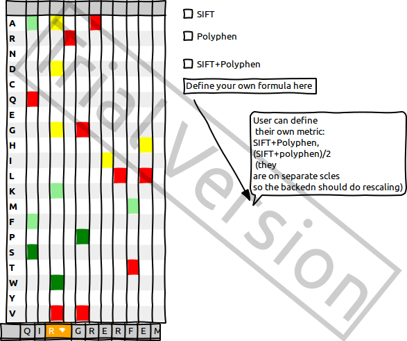
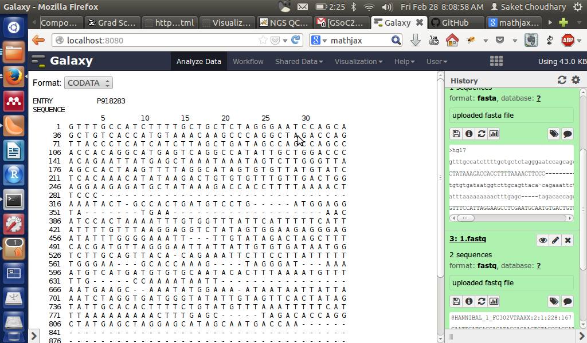

**BioJS Google Summer of Code Application**

# **Human Genetic Variation Viewer**

**Name:** 						Saket Kumar Choudhary

**Street Address:** 				A 19 Hastinapur , Anushakti Nagar

**City:** 				           	 	Mumbai                                     

**State:** 						Maharashtra                      

**Postal/Zip Code:**				400094

**Email Address:** 					saketkc@gmail.com

**Phone:		**				+91-9869649197

**University:** 					Indian Institute of Technology Bombay

Mumbai

India                                                                         

**Background:**					Bachelors & Masters in Chemical Engineering

					IIT Bombay

**Website:**					[http://home.iitb.ac.in/~saket.kumar](http://home.iitb.ac.in/~saket.kumar)

**Github:** 					[https://github.com/saketkc](https://github.com/saketkc)

**Bitbucket:**					[https://bitbucket.org/saketkc	](https://bitbucket.org/saketkc)

**CV:	**					[http://home.iitb.ac.in/~saket.kumar/saket_cv.pdf](http://home.iitb.ac.in/~saket.kumar/saket_cv.pdf)  

# **Introduction**

With the advent of NGS techniques, though we have been able to generated tonnes of data, little has been done to make sense out of the available data by integrating data across different levels in an integrative manner or even otherwise. Inspite of being made available as open and available from different sources, however there is none a tool that acts as an integrated visualiser.

The aim is to come up with an integrated framework that allows visualisation of Variation starting at the Amino Acid(AA) level. The framework should meet the following requirements:

* Scalability: 

    * The framework should be scalable to other data formats rather than just being restricted to AA. Thus it should be fairly easy to come up with similar visualisations using DNA variation data(nucleotides)

* Interactive:

    * The framework should provide a plug-in & plug-out interface using BioJS’s existing interacting plug-in framework(e.g., onSelectionChanged=>setSelection)

    * Since the data to be visualised has associated annotations(For e.g SIFT score, Polyphen score, SIFT/Polyphen nature prediction) which are expected to differ on a dataset basis, the user should have flexibility to perform exploratory analysis in an intuitive way

* Extensibility

    * The framework’s true potential lies in visualising data available across  different levels such as AA, nucleotide, protein domains, Structural visualisation of protein. Though the primary aim is to just come up with AA variation viewer, it should also allow binding it to other existing BioJS components such as the PDBViewer

# **Approach**

1. Assemble variation data  from Uniprot [1] 

* To throw in annotations would require yet another setup. I have a pipeline[2] available through Galaxy[3] that allows  one to assign scores such as SIFT[4], Polyphen[5], Mutation Assessor[6], transFIC[7], condel[8], CHASM[9] 

* This will allow more annotations to be thrown in for each mutation and thus can act as a comparative visualisation tool to compare different approaches for predicting the nature of mutation(deleterious or otherwise)

2. Populate a pipeline to render mutation data along with the reference sequence on a basic visualiser

* Using the BioJS Sequence viewer[10] and Feature Viewer[11] components the  AA sequences will be rendered while reading data locally either as a flat file or a json formatted file 

* It might be possible to  expose the pipeline as an API itself thus allowing the user to load data from URLs[using jsonp datatype for ajax calls]

3. Create Genetic Variation Viewer

* Given a target query sequence, the mutation data should be available in the form of a heatmap. A very basic version of how the heatmap would look like is shown in Figure 1.                            NOTE: There are known issues with the heatmap taking too large a vertical space, but it should serve as a good starting point till I finalise a better look for the same

		Figure 1 : Heatmap to visualise all possible mutations at each position

* In order to remove the redundancy that comes up with a 20 row table, though the number of possible mutations at a site will be limited to 4 or 5 would be something like Figure 2   

Figure 2: Alternate to heatmap[Figure1] for  visualising 

mutations across sites

4. Create ‘Zoomed Sequence Viewer’:

* The heatmap is limited to just the possible variants. In order to give detailed information about annotations such as SIFT/Polyphen score,  Frequency etc. the user will have an option to Zoom in at a particular sequence . Some possible options for visualising this would be Figure 3

Figure 3: Zoomed in information/annotation for a sequence

5. Add Frequency Visualiser for heatmap

* It would be possible to summarise the frequencies on th heatmpa using something like Figure 4

Figure 4: Frequency visualisation using pie-charts

* Figure 3 and Figure 4 might be redundant and might still not be the best solutions

6. Add plugin to visualise changes due to mutaion in the 3d structure of Protein

* The zoomed in sequence and also be visualised in 3D using BioJ Protein 3D Viewer [12] component 

7. Testing Framework

* The project will continue to grow with new modules being added, hence there is a dire need to involve some kind of testing framework for writing unit tests,

* Possible options are BusterJS[13] and JSTestDriver[14]

* More options at [http://stackoverflow.com/a/300855/](http://stackoverflow.com/a/300855/)

[1] [ftp://ftp.uniprot.org/pub/databases/uniprot/current_release/knowledgebase/variants/](ftp://ftp.uniprot.org/pub/databases/uniprot/current_release/knowledgebase/variants/)

[2] [https://github.com/saketkc/galaxy_tools](https://github.com/saketkc/galaxy_tools)

[3] [https://usegalaxy.org](https://usegalaxy.org)

[4] [http://sift.jcvi.org/](http://sift.jcvi.org/)

[5] [http://genetics.bwh.harvard.edu/pph2/‎](http://genetics.bwh.harvard.edu/pph2/) 

[6] [http://mutationassessor.org/](http://mutationassessor.org/)

[7] [http://bg.upf.edu/transfic/analysis](http://bg.upf.edu/transfic/analysis)

[8] [http://bg.upf.edu/fannsdb/](http://bg.upf.edu/fannsdb/)

[9] [http://wiki.chasmsoftware.org](http://wiki.chasmsoftware.org)

[10]  [https://www.ebi.ac.uk/Tools/biojs/registry/Biojs.Sequence.html](https://www.ebi.ac.uk/Tools/biojs/registry/Biojs.Sequence.html)

[11] [https://www.ebi.ac.uk/Tools/biojs/registry/Biojs.FeatureViewer.html](https://www.ebi.ac.uk/Tools/biojs/registry/Biojs.FeatureViewer.html)

[12] [http://www.ebi.ac.uk/Tools/biojs/registry/Biojs.Protein3D.html‎](http://www.ebi.ac.uk/Tools/biojs/registry/Biojs.Protein3D.html)

[13] [http://docs.busterjs.org](http://docs.busterjs.org)

[14][http://code.google.com/p/js-test-driver/](http://code.google.com/p/js-test-driver/)

<table>
  <tr>
    <td>Week</td>
    <td>Tasks</td>
  </tr>
  <tr>
    <td>Community Bonding Period

21 April - 18 May</td>
    <td>-- Interact with The BIoJS community to obtain their views on the initial design mocukps.
-- Discuss and Finalise framework internals, pipeline schema
-- Brush up d3.js/jquery</td>
  </tr>
  <tr>
    <td>Week 1

May 19 - May 25</td>
    <td>-- Pipeline for reading in data
    - Display sequences using BioJS Sequence Viewer
    - Display protein domains using BioJS feature viewer
-- Write Unit Tests</td>
  </tr>
  <tr>
    <td>Week 2 

May 26 - June 1
</td>
    <td>-- Render mutation heatmap 
   - Read in annotations to render a heatmap highlighting the deleterious(red) and non-deleterious(green) mutations
 -- Write Test</td>
  </tr>
  <tr>
    <td>Week 3

June 2- June 8</td>
    <td>-- Add support for viewing annotations from heatmap
 - Implenment annotation support in heatmap, Refer Figure 4 for example
-- Write Tests</td>
  </tr>
  <tr>
    <td>

Week 4 and Week 5

June 9 - June 15, June 16 - June 22
</td>
    <td>

-- Implement Zooming functionality to zoom into selected sequence
-Used3js zoom feature  
[https://github.com/mbostock/d3/wiki/Zoom-Behavior]
-- Generate frequency based annotated column as in figure 3 and figure 1

-- Write Tests and documentation </td>
  </tr>
  <tr>
    <td>MidTerm Deliverables</td>
    <td>--A basic tool to visualise overall heatmap of genetic variation in humans
-- Annotation viewer to visualise additional information
-- Documentation and Test Cases
</td>
  </tr>
  <tr>
    <td>Week 6

June 23 - June 29</td>
    <td>-- User defined formulae to create heatmaps
-- Write  tests</td>
  </tr>
  <tr>
    <td>Week 7

June 30 - July 6</td>
    <td>Implement zoomed in feature to visualise annotations such as in Figure 3 or 4 in a detailed fashion
-- Write tests and docs</td>
  </tr>
  <tr>
    <td>Week 8 and Week 9

July 7 - July 13, July 14 - July 20
</td>
    <td>--Add functionality to defined custom formula for SIFT/Polyphen scoring module
   - User specifies the formula in a text ox which is then parsed before rendering heatmap using the new set of values
--Write tests and docs</td>
  </tr>
  <tr>
    <td>Week 10 and Week 11

July 21 - July 27and July 28 - August 3</td>
    <td>--Add ability to visualise 3D structure of protein using BioJS interaction handles
  -Focused sequences will be highlighted and visualised on the 3D structure of protein

-- Docs and Tests</td>
  </tr>
  <tr>
    <td>Week 12

August 4 - August 10</td>
    <td>-- Tests and Documentation</td>
  </tr>
  <tr>
    <td>Week 13

August 11 - August 17</td>
    <td>-- Tests and Documentation</td>
  </tr>
  <tr>
    <td>Term end Deliverables</td>
    <td>--Genetic variation visualiser with 3D visualisation for Proteins
--User defined columns to generate heatmaps or compare various deleteriousness predictor scores
--Test cases and Documentation</td>
  </tr>
</table>

# **Challenges:**

* The biggest challenge is to make this visually appealing. Though JS is easier to tackle, this will also require heavy amount of correct CSS properties thrown in which probably is going to be the most time consuming part

* Making the looks same across browsers and different screen resolutions

* Since most of rending takes place via 

# **Other Commitments:**

I will be submitting my Masters thesis by the end end of May and would have no other commitments there after. 

# **Technology/Libraries to be used:**

* d3.js + jquery  for zoom functionality

* BioJS.Sequence.js and BioJS.FeatureViewer.js for visualising protein data

* BioJS.Protein3DUniprot.js for 3D visualisation 

* Some testing JS framework [BusterJS/JSTestDrive]

* SASS

# **About Me**

I am a final year Bachelors+Masters studying Chemical Engineering at

IIT Bombay, India.

I have been interested in Computational biology and Bioinformatics for

the past  two years. My Master's thesis revolves around developing new

algorithm for determining driver mutations. We have developed a new

set of Galaxy  pluggable tools to visualise the various driver

mutation identifiers. An overview of this is available on [[http://www.slideshare.net/saketkc/slides-27795057](http://www.slideshare.net/saketkc/slides-27795057)] One of the biggest motivation for applying to BioJS comes from this! My idea was to come up with a similar heatmap for visualising the difference between different softwares.

I was part of **Google Summer of Code 2013** with **Galaxy Project[3]**. I worked upon the workflow editor module besides  submitting a number of bug fixes 

[ [https://bitbucket.org/galaxy/galaxy-central/commits/all?search=saket](https://bitbucket.org/galaxy/galaxy-central/commits/all?search=saket)]. 

I still continue to contribute to Galaxy.Details are available on my GSoC2013 blog [[http://galaxy-gsoc2013.blogspot.in/](http://galaxy-gsoc2013.blogspot.in/)]

I was also a  **_Google Summer of Code 2012_** student for **Connexions** (http://cnx,org) and I am continuing  to contribute to the project. I worked on a Python/Pyramid submodule that allowed importing presentations from users’ desktop, converted it into CNXML(the native XML format developed by Connexions)  and deposited the slideshow to services like Slideshare and Google Drive, embedding it into a readable module. The user also could add a list of question answers at the end of the module. [[https://github.com/oerpub/oerpub.rhaptoslabs.slideimporter](https://github.com/oerpub/oerpub.rhaptoslabs.slideimporter)]

I developed interest in Biology during my fifth semester while undertaking a course on "*Introduction to Cell and Molecular Biology*".  In the subsequent semesters I took up extra course work in subjects that dealt with molecular or computational biology. I have undertaken courses on  Molecular Biology, Bioprocess Principles, and Computational Biology.

Besides Biology, I love to code and develop algorithms. I have a special interest in Machine Learning approaches. After taking up a basic course on **_Artificial Intelligence_** at my home institution, I was inspired by the subject and applied for an internship at EMBL-EBI(Cambridge,UK) where I was selected to work on **developing classifiers for EC number prediction** and a webservice for Job submissions for prediction jobs. I worked with Dr. Janet Thornton’s group [[http://www.ebi.ac.uk/thornton-srv/software/rbl/acknowledgements.html](http://www.ebi.ac.uk/thornton-srv/software/rbl/acknowledgements.html)] . This was essentially a Chemoinformatics project and hence introduced me to elementary bioinformatics.

For the past 2+ semesters, I have been working on **Next Generation Sequencing Analysis**. I explored the NGS domain, setup a pipeline(a basic shell script) using the standard sets of tools (BWA,samtools,GATK,ANNOVAR) and lately have been playing around with Galaxy . In the process I have concentrated on using Python in my pipeline and analysis work . I recently contributed a BWA wrapper for BioPython.

I contribute to some Bio* projects especially Biopython.

# **Programming Skills**

I am proficient in Python, Ruby, JAVA and MVC implementation[Django/RoR]. My level of expertise in JS is intermediate. Though I believe language is just a tool 

# **What programs have you coded so far?**

**1. BWA Wrapper for BioPython**

[[https://github.com/biopython/biopython/pull/167](https://github.com/biopython/biopython/pull/167)]

I use BioPython for my Computational Biology Course Assignments. Beside this  as part of my own NGS pipeline , I submitted a wrapper for BioPython

2. **open-ehr-django : An Electronics Health Record Management System**

[[http://github.com/saketkc/open-ehr-django](http://github.com/saketkc/open-ehr-django)]

Implemented a cloud based electronic health record management solution in Django( Python based MVC framework) for Hospitals and Clinicians to facilitate electronization of all the health records and tracking a patient’s medical history online. Done while working as a software developer for an Indian startup, I decided to open source it.

**3. SlideImporter For Connexions, GSoC2012 Project**

[[https://github.com/oerpub/oerpub.rhaptoslabs.slideimporter](https://github.com/oerpub/oerpub.rhaptoslabs.slideimporter)]

Implemented a slideimporter that allowed importing users slideshows to CNXML and deposited them to Google Drive and SlideShare. This is inturn imported into a Pyramid project [[https://github.com/oerpub/oerpub.rhaptoslabs.swordpushweb/tree/gsoc2012](https://github.com/oerpub/oerpub.rhaptoslabs.swordpushweb/tree/gsoc2012)]

**4. Scilab on Cloud**

[[https://github.com/saketkc/scilab_cloud](https://github.com/saketkc/scilab_cloud)]

Developed a Django based application that would enable runnign Scilab[[http://scilab.org/](http://scilab.org/)] a scientific computing software. This app allows user to run his/her Scilab codes online through a browser, thus removing the need to install Scilab Client locally. Scilab is an open source equivalent of MATLAB for numerical and scientific computing. This was widely[ accepted](http://mailinglists.scilab.org/Scilab-users-Run-your-Scilab-Codes-Through-Browser-td4025180.html#a4025189) by the scilab-users community.

This has now been ported to work on AAKASH  the low cost tablet:

[https://github.com/saketkc/scilab_on_aakash](https://github.com/saketkc/scilab_on_aakash)

URL :[ http://scilab-test.garudaindia.in/cloud/](http://scilab-test.garudaindia.in/cloud/) [ username : guest, password: guest123 ]

**5. IIT Bombay Grading System on SMS**

**[**[https://github.com/saketkc/iitb-library-sms-interface](https://github.com/saketkc/iitb-library-sms-interface)**]**

In a team of 4 I developed a Flask[[http://flask.pocoo.org/](http://flask.pocoo.org/)] based app to scrape through our institute’s Grading interface and send the Grades to a user on his mobile on request. I wrote the Scraping function making use of Beautiful Soup and urlib2 libraries.

**6.Google AppEngine Projects**

[[https://github.com/saketkc/Google-AppEngine-Projects](https://github.com/saketkc/Google-AppEngine-Projects)]

Developed a set of appengine applications  that allows programmtically Creating, updating deleting events from a Google Calendar, doing an ISBN search for a book given its name/author and a  Gmail bot that in the background inturn queries these interfaces to make them accessible over chat.

**7. Pivotal Tracker Email Bot**    

[[https://github.com/saketkc/pivotal-tracker-email-wrapper](https://github.com/saketkc/pivotal-tracker-email-wrapper)]	

Developed an interface using the Pivotal Tracker([http://pivotaltracker.com](http://pivotaltracker.com)) API in Ruby, an online Agile Project Management tool to create "New Issues"  by fetching emails from a gmail account. The guys at Pivotal Accepted this as a third party tool and is now listed here [[http://www.pivotaltracker.com/help/thirdpartytools](http://www.pivotaltracker.com/help/thirdpartytools.)]

**8.  DropBox on SMS**

[[https://github.com/saketkc/dropbox_on_sms](https://github.com/saketkc/dropbox_on_sms)]

This "Sinatra"[[http://www.sinatrarb.com/](http://www.sinatrarb.com/)] based app that lets one send a file from your dropbox folder to any email id , just with one SMS.  This app stood among the Top 20 at Yahoo! Open Hack India [ September 2011]. I participated as a student hacker.

**9. A blather[Ruby] based bot**

[[https://github.com/saketkc/blather-bot](https://github.com/saketkc/blather-bot)]

Implemented a bot using blather library in Ruby  to get Info about courses , their grading statistics and the upcoming events in the campus. This was  to make all this information to students irrespective of their location , since all this data is otherwise not viewable from outside the IITB network.

**10.DriveStack**

[[https://github.com/anilshanbhag/drivestack](https://github.com/anilshanbhag/drivestack)]  

Hacked during the Yahoo! HackU 2012 at IIT Bombay , DriveStack integrates all the cloud storage services like GDrive, box.net and Dropbox to give its user one unified ‘stack’ for file storage using the respective API. Our team was declared Winner.

**11.  dcpp.js**

[[https://github.com/saketkc/dcpp.js](https://github.com/saketkc/dcpp.js)]

Implemented a Javascript version of the popular Filesharing software DC++.  This essentially used  a python code for TCP socket programming and enalbed the user to

download files , without the need of a desktop client of DC++.

# **Do you have any code samples?**

With respect to BioJS, I attempted integration of  DNA Sequence viewer component with Galaxy:

Figure 5: DNA Viewer ported to work with Galaxy. Code:  

[https://github.com/saketkc/galaxy_tools/tree/master/visualisation_plugins/biojs_dna](https://github.com/saketkc/galaxy_tools/tree/master/visualisation_plugins/biojs_dna)

Other projects are available on my Github profile: [https://github.com/saketkc](https://github.com/saketkc)

# **Why BioJS?**

* Visualisation is a challenging and yet unsolved problem, BioJS makes it addressable

* Evaluating mutations as part of my Masters thesis,a visualisation framework is definitely helpful for studying consensus between different softwares

* A desktop based software is often limited by the architecture of the machine. BioJS’s ability to render eliminates this drawback by being cross platform and open source at the same time.

# **Are you familiar with JavaScript/jQuery?**

My work so far has involved more of Python and Ruby, since most of projects involved backend. However I have a keen interest in frontend as well. There were these major projects where I had to use js/jQuery:

1. SlideShare[http://www.slideshare.net]: 

	My project involved developing a clean user friendly Administrator interface for internal use to edit/delete/suspend slideshows. I made heavy use of JS in general and jquery(datatables) in particular.

       2. dcpp.js

	dcpp.js[[https://github.com/saketkc/dcpp.js](https://github.com/saketkc/dcpp.js)] is a browser based solution for P2P client DC++. The initial prototype relied on python since websockets were still a new thing back then.

        3. IIT Bombay Academic Council Websites

		This is a collection of websites I made [[https://github.com/saketkc/ug_acads](https://github.com/saketkc/ug_acads)] for Academic council, IIT Bombay along with a team of 3 members. It was a perfect mix of backend and frontend work. 

# **Is there anybody who can vouch for your experience? (with a contact info)**

**
**Prof. Santosh Noronha

Department of Chemical Engineering

IIT Bombay

[noronha@iitb.ac.in](mailto:noronha@iitb.ac.in)

# **What should be our strategy if you vanish during the project?**

Since I am going to implement something similar for my Masters project, there is absolutely no reason that I would need to run away or vanish from this. This has to be implemented either way, whether or not I qualify for GSoC, in order to meet up requirements of my Masters programme.

# **How do you envision your involvement with BioJS after the GSoC?**

**	**

As with my other GSoC projects (Galaxy and Connexions) I will keep contributing to BioJS. There are a number of components  that I would like to see in the BioJS registry which probably would come from my own creation. For example see the Fastareader I plugged into Galaxy [[https://github.com/saketkc/galaxy_tools/tree/master/visualisation_plugins/biojs_dna](https://github.com/saketkc/galaxy_tools/tree/master/visualisation_plugins/biojs_dna)]

I intend to extend BioJS registry for FastQ and NGS specific file formats.

# **Are you part of a research group?**

I work with the Protein Engineering Group at Department of Chemical Engineering, headed by Prof. Santosh Noronha. My Masters thesis is titled ‘Pattern Recognition in Clinical Data’ where we are trying to come up with better tools for visualisation and classification of drivers and passenger mutations in Cancer.

# **Have you had any lectures about Bioinformatics or Biochemistry? 			**

I have undertaken following courses:

* Introduction to Molecular Biology

* Molecular biology(Advanced)

* Genetics and Evolution of Biological Circuits

* Introduction to Computational Biology and  Bioinformatics

# **Have you contributed to any Open Source project before?**

**	**

My contributions to BioJS:

[https://github.com/biojs/biojs/pull/29](https://github.com/biojs/biojs/pull/29)

[https://github.com/biojs/biojs/pull/30](https://github.com/biojs/biojs/pull/30)

My contributions to Galaxy: 

[https://bitbucket.org/galaxy/galaxy-central/commits/all?search=Saket](https://bitbucket.org/galaxy/galaxy-central/commits/all?search=Saket)

My contribution to Biopython:

[https://github.com/biopython/biopython/pull/167](https://github.com/biopython/biopython/pull/167)

[https://github.com/biopython/biopython/pull/180](https://github.com/biopython/biopython/pull/180)

My Contributions to MNE-Python:

[https://github.com/mne-tools/mne-python/pull/1135](https://github.com/mne-tools/mne-python/pull/1135)

[https://github.com/mne-tools/mne-python/pull/1130](https://github.com/mne-tools/mne-python/pull/1130)

**                 **

# **What is your ideal approach to keeping everybody informed of your progress, problems, and questions over the course of the project? 					**

**		**

In order to keep BioJS community update with my progress, I would maintain a blog. I would update the blog at the start of every week on Monday with my accomplishments for the  previous week and targets for the next week. i found this approach quite useful with my GSoC2013 project: 

[http://galaxy-gsoc2013.blogspot.in/](http://galaxy-gsoc2013.blogspot.in/)

I also made heavy use of IRC last time and think that it can does hel as one of the best communication channel.

Besides this, I would keep in touch with mentors over email and Skype.

# **What should be our strategy if you vanish during the project? How do you plan to plan to keep yourself on track? 	**		

I have specifically listed down each week’s deliverables by being as specific as possible. I would aim at sticking to each week’s goals.

However with the past GSoC experience I have learnt that things some time do not turn out to be the way they are planned in the proposal. I have kept last two weeks for testing. I however speculate that some of the things will eventually get pushed on to the later two weeks.

The proposal also might sounds a bit too ambitious, but I fell implementing just a standalone genetic variation viewer in itself should though be the Primary task(something that I would try to finish before Mid term evaluation), a vanilla viewer is best complemented by the add-ons that I plan to implement post the mid term evaluations.

# **Is there any special reason why we should pick you?**

I have a special connect with the project owing to its relevance to my Masters thesis. This would probably ensure a higher level of commitment. Besides that I have my own ideas that I plan to implement as extensions to this registry, thus contributing long term.

# **How can we contact you?**

** **

**  **Skype:        kcsaket

  IRC:           saketkc

  EMail:        [saketkc@gmail.com](mailto:saketkc@gmail.com)

  Phone:      +919869649197

**Notes from Meetings/Mails**

[https://docs.google.com/document/d/1d7roTdwXtzoDP5jN2unEWdIZwuwE9eedV5431wfQEBc/edit#](https://docs.google.com/document/d/1d7roTdwXtzoDP5jN2unEWdIZwuwE9eedV5431wfQEBc/edit#)

