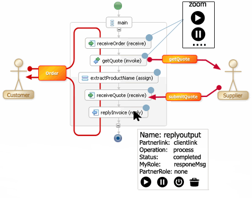

## Google Summer of Code 2015 Project Proposal

## Apache Software Foundation/ODE-1029

Project Title:  Process Instance Visualization for Monitoring Console

## 1-   Personal Details

 

**Contact details**

**Name:**                          Kamdjou Temfack Duplex Marie

**Email:**                          tony14pro@gmail.com

**Phone**:                         +237 670274538

**IRC nickname:**           JS_man

**Blog**:                           [http://js-man.blogspot.com](http://js-man.blogspot.com)

**Github:**                           [https://github.com/kamdjouduplex](https://github.com/kamdjouduplex)

**Linkedin:**                    kamdjou temfack

**About me**

* I am a final year Software Engineering student at the  University Buea,Cameroon. I am passionate and skilled in User Experience Design (UX) using web technologies and languages like JavaScript, AngularJS, HTML5, CSS3, Twitter Bootstrap and Node Package Manager (npm).

* I have worked on several projects and was a Regional finalist for the Microsoft Imagine Cup 2014 contest, using HTML5 and JavaScript technologies with a core goal to differentiate my projects through added value on simple basic online tools with great User Interfaces and User Experiences. I believe that abstracting the underlying processes in a product from a user so that he can focus on  using his/her tools to improve his productivity is not enough; I believe that as a product developer, I am tasked with making the user’s experiences to be pleasurable so that the user’s work is not only easy, but is desirable, loved and memorable.

* I worked in a team during two hackdays to build the GDG Buea site [http://www.gdgbuea.org](http://www.gdgbuea.org) using (**Polymer, JavaScript, Bootstrap, HTML5 & CSS3**), I also participated in building a realtime event management app for TV fans using AngularJS and Firebase (site:[https://yopisode-event.firebaseapp.com/#/](https://yopisode-event.firebaseapp.com/#/) repo:[https://github.com/kamdjouduplex/yopevent-developments](https://github.com/kamdjouduplex/yopevent-developments)). I have as well built an application in preparation for the upcoming Google Cloud Challenge using Java EE, JavaScript,HTML5,CSS3, Google AppEngine, BlobStore and Datastore. (site:[http://larrytectest.appspot.com/contact](http://larrytectest.appspot.com/contact)   repo: [https://github.com/kamdjouduplex/tech-biz](https://github.com/kamdjouduplex/tech-biz))

* I have handled a two-day AngularJS meetup in Buea to introduce the University Developer Community to AngularJS

* I am an active member of the Google Developer Group (GDG) of Buea Cameroon

 **Interests**

I am always very excited about projects that involves the use of interfaces to create new and better experiences. I love the web and mobile worlds. My love for using interfaces to create lovable abstractions on the web pushed me to love and master HTML5, CSS3, JavaScript (jQuery, AngularJS). I especially love the new possibilities on the browser when HTML5 new features like Canvas play with JavaScript.

I am very motivated about this project because it will enable me to use these technologies to abstract the complexities of the console with beautiful graphical visualizations. 

## 2-   Personal Availability

I have reviewed the GSoC 2015 Timeline and I am agreeing that I will be fully available without any constraints during the time mentioned there. Except that I could be off for one week by the end of July for my second semester exams.

## 3-   Project Abstract

Business Process Execution Language (BPEL) which is a graphical language for orchestrating web services, being a scalable project. I will be focused on "Process Instance visualization for Monitoring Console" by translating “.bpel” files to “.html” files and to also make sure that the graphical representation of status of different activities of each process can be easily noticed without any effort. So, the main objective is to graphically render a BPEL (Business Process Execution Language) processes so that users can know which activity is already executed completely, which is still pending and which has failed to be executed by being as much as possible consistent with UI components used to get the user familiar with the platform within a short time.

## 4- Implementation

**UI and UX Design**

As we already have the basic console I will implement the graphical representation of all details activities of each particular process by converting each activity name and status to its corresponding graphical  component which include a small customised icon as showing at the top-right corner of each activity to directly let the user know of the status of the activity. and also we will make it possible for a user to get all informations concerning an activity as he pass the mouse over it.

the figure below is the better illustration of it.

the two black circles with the play and pause symbol at the top-right is representing the zoom of the small blue icons in each activity and can be the icon of any status

**Proposed Approach (Algorithm)**

We know that form the .bpel file it is possible to fetch the name and the status of each activity, by using a two dimensional mapped array to initialize all the possibility cases to easily display the correct graphical component as explained in the algorithm snapshot;

/* create and initialise our array here */

**var map_array[][] = "";**

**["activity1"][“status1”] = component1;**

**["activity1"][“status2”] = component2;**

**["activity1"][“status3”] = component3;**

**["activity1"][“status4”] = component4;**

**….**

**…..**

**….**

**….**

/* get value of a and s from the bpel file we can handle it like this */

**function(a,s) {    **// where a and s represent respectively "activity" and “status”

/* now from value of "activity" and “status” passing as arg to the function we can display the corresponding component*/

**alert(map_array[a][s]);**

/* now for error handler we can check it as follow */

**if(map_array[a][s]  == noexist) {**

		/* if the activity and status does not exist we */

		/*display a specific component for that** */**

**		alert(spacify_component);**

**}**

**}**              

**Schedule and Timeline**

I propose to release the beta version of the project after 8 weeks and update it (from the user's feedback) using agile development methods. I will be able to devote at least 6 hours per day on weekdays and 10 hours per day during the weekend to get at least 40 hours per week.

March 27 - April 27: 

(4 weeks)

* Study about the  Extensible Stylesheet Language Transformations(XSLT) language

* Study of the AngularJs ode-console repository [https://github.com/kamdjouduplex/ode-console](https://github.com/kamdjouduplex/ode-console)

* Further studies about the WS-BPEL

April 28 - May 25:  Community bonding period

(4 weeks)

* Study ODE/BPEL manuals,tutorials series and documentation.

* Compile ODE-CONSOLE source code ,Study code base and remove bugs.

* Discuss with other developers and ODE/BPEL mentors to define mailing-list  etiquette  

*  Acquaint myself with necessary technologies like HTML5 canvas/svg and   Extensible Stylesheet Language Transformations (XSLT)

May 26 - July 24: Work period (Pre-mid term evaluation)   

(2 weeks)

* Implementation of added graphical components

* Integrating those components to the fonts of the project

(2 weeks)

* Using AngularJs to bind activities’ status changed to auto layout component

* Integrating vertices feature to related processes activities among them

July 25 - August  12: Pencils down period (Testing and Documentation)

(2 weeks)

* Final testing and debugging of  ode-console code.

* Final touching  

August 13 -August 21: Pencils down (Documentation and Final submission)

(1 week)

* Documenting the Process Instance Visualization for Monitoring Console code

* Final submission of ode-console code to Google

**5- ****W****hy**** APACHE ****SOFTWARE**** FOUNDATION ?**

First of all, I really believe that software can change the world by providing new technologies and that software should be free. I choose APACHE                           FOUNDATION because it is a not-for-profit technology organization which offers me the opportunity to assist the world of web services (WS) with tools which help users orchestrating and monitoring their processes without any stress . Working with APACHE/ODE also helps me contribute over the long-term and gain status within the hacker community based on my Engineering/Designing background and academic interests. Although I have not contributed before to open source ,I see implementing a graphical visualization as a long-awaited opportunity to provide more easier appreciation of processes orchestration for the APACHE/ODE software and a jump-start to my continued contribution to open source software through APACHE FOUNDATION.This project will also help APACHE FOUNDATION and other organizations dealing with Web Services to integrate the graphical representation of activities on any other project. 

## 6- Why am I the right person to take this project ?

I am passionate about open source technologies and i have used the Apache Web server together with other open source  technologies for my personal and class projects. I believe in the open source culture of sharing and will like to give back to the Open source community by my participation in this year's GSOC 2015.  

An African contributing to open source technology will go a long way to increase technology awareness in our continent  and will drive the innovators  of the future.

