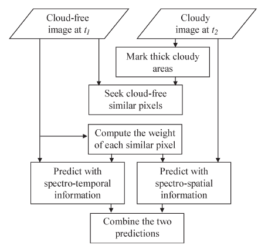

**Name: **Anuj Pahuja

**IRC handle: **alasin

**Email -** [kamikazeanuj@gmail.com](mailto:kamikazeanuj@gmail.com)

**Location: **Gurgaon, India (GMT + 0530 hrs)

**Project Title: **Cloud removal from Satellite Imagery in GeoTrellis

**Motivation for the proposal:**

Having worked on multiple Image processing and Computer Vision projects like object tracking, image retrieval and video stabilization, the idea of combining computer vision with a functional language is still new to me and hence, all the more interesting. The eagerness to learn and work on something as cool as this, coupled with my interest in Computer Vision encouraged me to work on this project and contribute to GeoTrellis. Even after the project gets over, I plan to implement other CV algorithms like image segmentation for satellite imagery in GeoTrellis.

**Abstract:**

Clouds and cloud shadows often obscure parts of images acquired by satellites or other space-borne sensors. However, useful image data could be extracted from other relatively non-cloudy images of the same geographical location that can be used to ‘fill’ these obscure parts. Multiple images can be captured of an area of interest over time, such as Landsat images. When combined together with the right algorithms, these images can offer a cloud-free (or nearly cloud-free) view of that area. GeoTrellis is already great at distributed raster processing on a cluster. If it were enabled with the power to remove clouds from a large set of imagery, it would enable users to run that process over any amount of imagery, in a scalable way. 

**Implementation Details:**

This project will assume that the imagery to be operated on is already stored inside a GeoTrellis system, and can be retrieved by GeoTrellis as a RasterRDD. The retrieval of imagery will be handled by the GeoTrellis system, and while some functionality might be required to correctly produce a set of overlapping imagery to be processed, this project will focus on the cloud removal processing of imagery that is provided by this method.

The cloud removal functionality will be implemented in broadly three steps:

Cloud detection using Fmask[1]:

Fmask algorithm developed by Zhu et al.[1] will be implemented to detect clouds and cloud shadows in the input images and generate corresponding cloud masks for further processing. The algorithm would take in the Top of Atmosphere (TOA) reflectances for Bands 1, 2, 3, 4, 5, 7  and Band 6 Brightness Temperature (BT) of the Landsat images as the inputs. Then, rules based on cloud and cloud shadow physical properties would be used to extract a potential cloud layer and a potential cloud shadow layer. This would mainly involve spectral tests on the images to identify Potential Cloud PIxels (PCPs). Some of these tests are:

* Spectral tests on the images to identify Potential Cloud Pixels (PCPs).

* Setting thresholds for NDSI (Normalized Difference Snow Index) and NDVI (Normalized Difference Vegetation Index). 

* Performing a Whiteness test for cloud pixel identification.

* Performing a Haze Optimization Transformation (HOT) test.

* Performing a ‘Water Test’ to separate water and land pixels.

Based on these tests, cloud probability for all pixels will be calculated and a potential cloud layer and cloud shadow layer would be extracted. Finally, the segmented potential cloud layer and the geometric relationships would be used to match it with the potential cloud shadow layer, leading to the production of the final cloud and

cloud shadow mask which will be saved as another image.

Processing the cloud masks and base images:

The image containing the cloud mask would be binarized so as to separate the actual cloud and cloud shadow from other pixels. The mask image would further be processed depending upon the absence of data in the original image. Depending on the position of cloud regions in the *fill *images, or the less cloudy images, a composite labeled cloud mask would be formed labeling pixels as background pixels, clouded pixels in base image and clouded pixels in *fill* images.

Filling Cloudy regions:

For filling the cloudy regions, an NSPI cloud fill algorithm by Zhu et al.[2] will be implemented. The algorithm uses a weighted linear model to predict the spectral value of a target pixel from its neighbouring similar pixels. Here is the flowchart describing this approach[2]:

It’s important to note that the Fmask algorithm described above is limited to Landsat/ETM+ images and thus, restricts the scope of this algorithm. However, the project is in service of implementing cloud removal algorithms for multiband imagery in general, and to make improvements in the framework that allow general algorithms to run over imagery data. Implementation of the Fmask algorithm will be an initial step towards those broader framework improvements. The project aims to be an initial step towards cloud removal for satellite imagery in general. 

[1] Zhu, Z. and Woodcock, C. E., Object-based cloud and cloud shadow detection in Landsat imagery, Remote Sensing of Environment (2012).

[2] Zhu, X., Gao, F., Liu, D., Chen, J., 2012. A modified neighborhood similar pixel interpolator approach for removing thick clouds in Landsat images. Geoscience and Remote Sensing Letters, IEEE 9, 521–525. 

**Tentative Timeline:**

28 April - 24 May (Community Bonding Period): 

* Setting up the development environment.

* Getting familiar with GeoTrellis codebase and its API use.

* Learning more about Scala and its properties. 

* Getting the test dataset and software ready for the project.

* Discussing the flow of action and finalizing a workplan with the mentor. 

25 May - 8 June (2 weeks):

* Implementing the first pass of extracting potential cloud layer which comprises of doing a Cloud Test, Snow Test and Water Test for pixels.

9 June - 16 June (1 week):

* Implementing the second pass of extracting potential cloud layer by computing cloud probability for all the pixels.

17 June - 24 June (1 week):

* Extracting cloud shadow layer from the image.

25 June - 9 July (2 weeks):

* Matching the extracted cloud with its corresponding shadow layer and generating the final mask file.

10 July - 24 July (2 weeks):

* Processing base images and the mask files, labeling them accordingly and generating final mask for the cloud fill algorithm.

25 July - 8 August (2 weeks):

* Implementing the modified NSPI algorithm for filling cloudy regions using the mask obtained above.

9 August - 21 August (Pencils Down):

* Integrating everything with the main software.

* Testing code for other datasets and solving bugs.

* Cleaning up code and writing instructions for use.  

 	 	 	

**Other Commitments:**

I have no other commitments during the coding period and will be able to work for 40-45 hours per week. Having successfully completed GSoC last year, I am confident that I will be able to manage my time efficiently and devote as much time as required to complete the project.

**About me:**

I am a final year undergraduate student pursuing my Bachelors in Computer Science from BITS Pilani. Apart from having lots of interest in computing in general, I have been an open source enthusiast from past 3 years and have participated in GSoC 2014 with KDE and have also mentored students in Season of KDE and Google Code-In.

I have a keen interest in Image Processing and Computer Vision, having worked on Motion based object tracking, video stabilization, image analysis methods, content-based image retrieval and image deconvolution. Working on Computer Vision with Scala will be a first for me and I hope the experience will keep getting better.

My Github profile [here](https://github.com/alasin/).

My LinkedIn profile [here](http://in.linkedin.com/in/anujpahuja).

