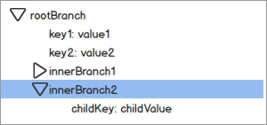
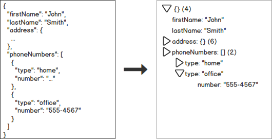
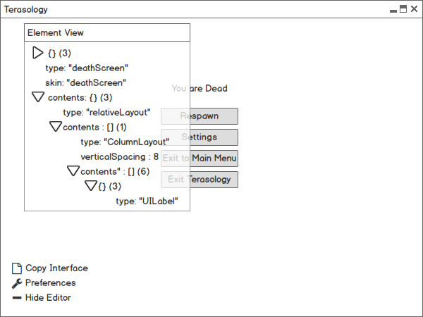
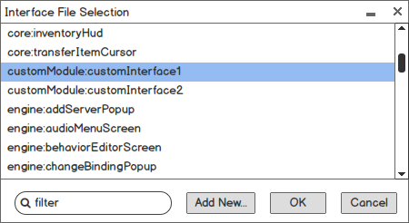
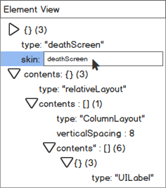
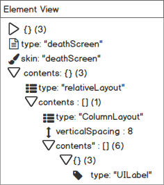
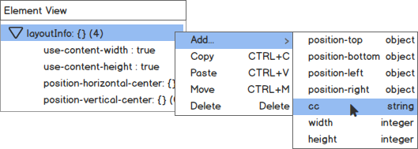
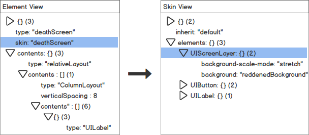

# 1. About Me

## 1.1. Basic information

* *Name:* Rostyslav Zatserkovnyi

* *Email:* [zatserkovnyi.rostyslav@gmail.com](mailto:zatserkovnyi.rostyslav@gmail.com)

* *GitHub:* [https://github.com/rzats](https://github.com/rzats)

* *IRC handle:*	rzats

* *Forum account:* [http://forum.terasology.org/members/1659/](http://forum.terasology.org/members/rostyslav-zatserkovnyi.1659/)

* *Timezone:* UTC+02:00 (Eastern European time)

## 1.2. Background and programming experience

I am a third year student of the Ivan Franko National University of Lviv (Western Ukraine), pursuing a degree in Applied Mathematics and Informatics (Computer Science with an emphasis on computational mathematics). I originally started programming in C/C++ in my final year of school, later moving on to C#/.NET while also dabbling in Python, PHP and HTML/CSS/JavaScript. I later took up Java while doing a course on Object Oriented Programming and have been working in Java ever since. I primarily use [IntelliJ IDEA](https://www.jetbrains.com/idea/) for Java development and [cmder](http://cmder.net/) for all my Git-related needs. 

I am familiar with Java’s core features, JUnit-based testing and UI frameworks (AWT, Swing, JavaFX). I’ve previously participated in open-source Java development, having created a Swing-based Tool (IDE add-on) for the [Processing](http://processing.org) open-source project that extends the development environment with additional customization features: [[rzats/font-highlighting-editor]](https://github.com/rzats/font-highlighting-editor).

## 1.3. Contributions to MovingBlocks

* In progress

 * [[MovingBlocks/TeraNUI]](https://github.com/MovingBlocks/TeraNUI) Created a skeleton repository for future NUI extraction.

 * [[rzats/DestinationSol-gestalt]](https://github.com/rzats/DestinationSol-gestalt) Integrating the gestalt-asset-core and gestalt-module libraries into Destination Sol to replace the game’s rather unwieldy solutions regarding asset management and to test the libraries’ usability on Android.

* Accepted and merged

 * [[Terasology#2192]](https://github.com/MovingBlocks/Terasology/pull/2192) Created an Eclipse config file that enforces an order of Java imports consistent with that of IntelliJ.

 * [[TerasologyLauncher#351]](https://github.com/MovingBlocks/TerasologyLauncher/pull/351) [[Terasology#2197]](https://github.com/MovingBlocks/Terasology/pull/2197) Implemented a JVM flag allowing the user to configure the Logback log level for the game to finetune log file complexity, as well as an option to change the flag using the launcher.

 * [[Terasology/Menu/Ukrainian@Weblate]](http://translate.terasology.org/projects/terasology/menu/uk/) Created a complete Ukrainian localization for the game’s Menu component.

 * [[Terasology#2215]](https://github.com/MovingBlocks/Terasology/pull/2215) Added a zero-size check to inventory UI code to prevent the game crashing when attempting to load an incomplete UI file in a certain context. *Note that an alternative, improved fix has been subsequently created: [Terasology#2216](https://github.com/MovingBlocks/Terasology/pull/2216)*

 * [[DestinationSol#85]](https://github.com/MovingBlocks/DestinationSol/pull/85) Fixed several minor issues related to Destination Sol’s repository.

 * [[CrashReporter#28]](https://github.com/MovingBlocks/CrashReporter/pull/28) Added an additional panel that allows (and forces) the user to enter additional info about the error they’re reporting, preventing unhelpful error reports lacking additional details or context.

 * [[Terasology#2193]](https://github.com/MovingBlocks/Terasology/pull/2193) [[Terasology wiki / Eclipse]](https://github.com/MovingBlocks/Terasology/wiki/Eclipse) Submitted miscellaneous documentation fixes and improvements.

# 2. Proposal Information

## 2.1. Project summary

**Standalone NUI extraction and visual NUI editor**

Currently, **Terasology** uses its own **NUI** (New User Interface) framework to render in-game UI elements. This solution works great for the game’s purposes and has the potential to stand out as a separate library, used in MovingBlocks’ open-source adoptee **Destination Sol** and various other game projects. The proposed project aims to extract the framework into a standalone library and create a visual editor application for **NUI** interface definition files to facilitate developer and modder interest.

## 2.2. Project description and timeline

### Phase 1: Extracting NUI into a separate library (Pre-GSoC / Community Bonding)

An integral first step is to decouple NUI from the main Terasology codebase in order to utilise it in the standalone editor and, potentially, other open-source game projects. To accomplish this, the framework will be extracted as a standalone library into a repository located under the [MovingBlocks organization](https://github.com/MovingBlocks/) on GitHub. Some of NUI’s notable dependencies will be extracted as separate libraries along with the core framework:

1. **nui-input** (extracted from [org.terasology.input](https://github.com/MovingBlocks/Terasology/tree/develop/engine/src/main/java/org/terasology/input)) - implements a set of utilities for working with user input, including abstract input device representations (Keyboard/Mouse/Controller) and databinding utilities. This package will be extracted without any significant changes to the code structure.

2. **nui-assets (extracted from [org.terasology.rendering.assets](https://github.com/MovingBlocks/Terasology/tree/develop/engine/src/main/java/org/terasology/rendering/assets))** - will contain the **gestalt-asset-core**-based assets used by NUI (e.g. Font, Texture) and the Assets utility class. Alternatively, the Assets class may be sufficiently improved and generalized to become a part of **gestalt-asset-core**.

I have already made some progress regarding this phase of the project: a skeleton repository has been set up for the framework ([MovingBlocks/TeraNUI](https://github.com/MovingBlocks/TeraNUI)) and, after some research, an in-depth summary of dependency resolution necessary to decouple the framework has been created ([Proposal Supplement - NUI extraction](https://docs.google.com/document/d/1tuN_Xv8QqWrg-e5Ckb2Ky_szkWuNSRW5MJOn8Xn8iu0/edit?usp=sharing)).

In addition to Terasology integration testing, NUI will be partially integrated into Destination Sol. The game’s keybinding settings can benefit from **nui-input** usage, allowing support for multiple keybindings - therefore, the game’s [InputMap](https://github.com/MovingBlocks/DestinationSol/tree/develop/main/src/org/destinationsol/menu) class family will be refactored to utilise the library.

### Phase 2: Creating a visual NUI editor (GSoC Coding Period)

Several ideas have been discussed in the proposal’s issue of origin [[Terasology#849]](https://github.com/MovingBlocks/Terasology/issues/849) regarding the NUI editor’s exact implementation. After carefully considering all of the suggested options, I’ve chosen to implement the editor as a build-in module with engine access, structured similarly to the Behavior Tree Editor developed along with the behavior tree API ([Terasology forum reference](http://forum.terasology.org/threads/behavior-trees.882/)).

This approach will allow the editor to easily draw NUI widgets by interfacing with the game’s UI drawing function ([pushScreen(UIElement element)](https://github.com/MovingBlocks/Terasology/blob/develop/engine/src/main/java/org/terasology/rendering/nui/internal/NUIManagerInternal.java#L243)) directly, allowing for complete support of custom UI elements. However, one drawback is that the editor, being a micro-IDE of sorts, may not be as well-suited to running within the game as the more visual-oriented BTE. After GSoC, the tool may be extracted into a separate Java application with an in-game facade.

The following features will be implemented within the scope of GSoC:

* **UITreeView widget**

A widget implementing a Tree View - a common visual representation of an informational hierarchy (see: [Wikipedia - Tree View](https://en.wikipedia.org/wiki/Tree_view)) - as a NUI [CoreWidget](https://github.com/MovingBlocks/Terasology/blob/develop/engine/src/main/java/org/terasology/rendering/nui/ControlWidget.java) override will be created. The widget will represent its data as an in-memory tree data structure (**UITreeItem**) largely based on a similar data structure used in the JavaFX UI framework (see: [JavaFX documentation - TreeItem](https://docs.oracle.com/javase/8/javafx/api/javafx/scene/control/TreeItem.html)). Specifically, the information about the TreeItem’s expanded structure will be stored in the data structure himself (as opposed to the TreeView), allowing for tree state serialization and restoration.

The tree view will support editing operations, with a boolean flag made available to make the tree read-only. These consist of node addition, movement, deletion, copying and pasting. Interactivity options will be implemented by each of the nodes being assigned an [InteractionListener](https://github.com/MovingBlocks/Terasology/blob/develop/engine/src/main/java/org/terasology/rendering/nui/InteractionListener.java) override.

The widget will be sufficiently documented and tested to be introduced into NUI’s core codebase, as it can be reused in other modules requiring a tree-based representation of various components: for instance, a module dependency browser or a rendering pipeline visualizer.

*Figure 1: UITreeView mockup*

*Approximate implementation time: 2 weeks (May 23rd - June 4th).*

* **JSON to tree view adapter**

A custom deserializer designed to work with the UITreeView component developed in the previous phase of the project will be developed. This utility class will generate a TreeView based on a JSON file, with value types represented as leaf nodes and arrays/objects as separate branches tracking and visually representing the number of their child items. A similar serializer method will reconstruct the JSON file based on a TreeView by iterating through the root TreeItem.

Since a JSON deserializer can be used for other purposes within Terasology (e.g. Shape or Prefab editors), this adapter will also become a core NUI utility class.

*Figure 2: Adapter usage example (data source: [Wikipedia](https://en.wikipedia.org/wiki/JSON#Example))*

*To save horizontal space, the first value of an array member object is displayed as the branch name and one-item arrays are represented as objects (i.e. do not expand into a separate tree branch containing one object).* 

*Approximate implementation time: 1 week (June 6th - June 11th).*

* **Core editor interface definitions**

NUI-based interface definition files used by the editor will be developed in the following order:

1. Button bindings and command line options to activate the NUI editor.

2. Control element that hides the active NUI editor when clicked on. Subtle and transparent; placed in a configurable corner of the screen.

3. Interface file selection menu. (See further phases for implementation details)

4. Free-floating JSON tree view window. (See further phases for implementation details)

5. Editor preferences menu and a Copy Interface button.

The interfaces developed during this phase will be initially populated with stub elements and won’t be interactive - their actual functionality will be developed in subsequent stages. This approach is meant to facilitate early feedback about the editor’s look-and-feel and, if necessary, implement major interface changes before they require a substantial amount of refactoring. The editor’s Preferences menu will be constantly populated with new items - including temporary debugging options that won’t ever make it to a weekly release - throughout the development of the project. Several advanced options intended for end users will also be implemented later on.

*Figure 3: Overall interface mockup (data source: [deathScreen.ui](https://github.com/MovingBlocks/Terasology/blob/develop/engine/src/main/resources/assets/ui/ingame/deathScreen.ui))*

*Approximate implementation time: 1 week (June 13th - June 18th).*

* **Canvas and file selection implementation**

The file selection menu developed in the previous phase will be populated by a list of the game’s asset files. When an asset is selected (by either using an ingame console command or picking an asset from this menu), the widgets generated from the UI definition will be loaded on the canvas area and the free-floating tree view window will be populated with the interface file’s elements using the JSON tree view adapter.

*Figure 4: Interface file selection mockup*

*Approximate implementation time: 1 week (June 20th - June 25th).*

*The above items constitute the deliverables list for midterm evaluations.*

* **Widget addition, movement, copying and deletion**

In the tree view editor window, "Add Widget" entries will be added to the appropriate nodes’ context menus. When this option is selected, the user will be shown a list of the game’s available UI widgets - including custom widgets - fetched using the [getWidgetMetadataLibrary()](https://github.com/MovingBlocks/Terasology/blob/develop/engine/src/main/java/org/terasology/rendering/nui/internal/NUIManagerInternal.java#L403) method. After a widget is drag-and-dropped from the list onto the canvas surface, a corresponding definition will be generated in the asset file and the canvas is updated accordingly. Other widget operations - movement within the hierarchy, copying & pasting and deletion - will be performed within the UITreeView window, the foundation for them having been laid earlier.

*Approximate implementation time: 1 week (June 27th - July 2nd)*

* **Inline property editor**

The TreeView window will be further updated to make JSON value types (located in leaf nodes) editable when double-clicked, the node’s value being replaced with a simple [UITextEntry](https://github.com/MovingBlocks/Terasology/blob/develop/engine/src/main/java/org/terasology/rendering/nui/widgets/UITextEntry.java) field. After each edit, type validation on the new value will be performed - if all of the relevant checks are passed, the in-memory interface asset file will be updated with the new UI definition.

*Figure 5: **Inline property editing mockup*

*Approximate implementation time: 1 week (July 4th - July 9th).*

* **Widget icon support**

At the start of this phase, icons for all of the game’s default UI widgets will be created (located at */assets/textures/ui/icons/*). These will preferably originate from an icon toolkit already used by the game or similar to it in terms of look-and-feel.

The editor’s TreeView and widget addition windows will attempt to match each widget’s type to a PNGTextureFormat asset with the same name - if a relevant icon is found, it will be appended to the beginning of the "type" node; otherwise an empty or placeholder icon will be used. Modules that contain custom widget types will be able to define their own icon assets to be used in the NUI editor.

In addition to this, icon support for the common properties used in interface definitions (*skin, verticalSpacing, horizontalSpacing etc.*) will be added - they will display an icon alongside them regardless of their value.

A option will be made available in the Preferences menu to disable all icon support altogether should the user choose to prevent visual cluttering.

*Figure 6: TreeView icon support mockup*

*Approximate implementation time: 1 week (July 11th - July 16th).*

* **Smart property addition**

A property addition context menu will be created - when a branch is right-clicked (leaf nodes will have no such option), several custom options for adding properties will be made available depending on the node’s type. For instance, *layoutInfo* nodes will have the options to add *position-top*, *position-bottom, position-left, position-right, position-vertical-center* and *position-horizontal-center* object properties, *cc* string property, *width* and *height* integer properties and the *use-content-width & use-content-height* boolean properties. When a specific option is selected, an appropriate property with a default value will be generated.

*Figure 7: Smart property addition mockup*

Some research time is added to this phase in order to determine how a list of possible JSON values can be obtained from a class - if necessary, a new annotation type to be evaluated by the parser will be implemented and applied to default widgets.

*Approximate research and implementation time: 2 weeks (July 18th  - July 30th)*

* **Interface skin editor**

	A skin editor tree view similar to the element tree view will be created, activated when an option in the skin node’s context menu is selected. This view will reuse many of the features developed earlier, but will require some additional updates to smart property addition and element icon support.

*Figure 8: Skin editor view mockup*

*Approximate implementation time: 1.5 weeks (August 1st - August 10th)*

* **Advanced editor preferences and file saving**

Some additional features will be added to the Preferences menu of the editor that was developed during an early phase of the project:

* *Interface locale settings* - changes the locale of the UI being edited (the locale of the editor itself is inherited from in-game player settings). It’s primary use will be testing different localization strings that may significantly alter the appearance of the interface.

* *Editor control element location* - changes the location of the editor’s Preferences and Hide buttons (top left, bottom left, top right, bottom right)

* *Element view window transparency* - self-explanatory.

* *Autosave UI on change* - self-explanatory.

Additionally, the Copy Interface button developed earlier will be configured to copy the serialized JSON interface to the user’s clipboard so that they can manually insert it into the relevant asset file to apply the changes. This is a rough workaround caused by current module security restrictions and an improved solution may be developed post-GSoC.

*Approximate implementation time: 3 days (August 11th - August 13th)*

* **Wrap-up and release** 

The editor will be fully released and deployed to Terasology’s Artifactory. A tutorial article to be located on Terasology’s [Github wiki](https://github.com/MovingBlocks/Terasology/wiki) will be developed and a small video showcase will be created.

*Approximate implementation time: 3 days (August 15th - August 17th)*

**_Buffer period: August 18th - August 23rd_**

## 2.3. Additional notes

I’m planning to dedicate 42 hours per week to the project (7 hours per day, Monday to Saturday). Sundays will be spent restructuring the code created throughout the week and submitting it in a pull request for evaluation.

The project repository will utilise the [git-flow](http://nvie.com/posts/a-successful-git-branching-model/) methodology:

* Features will be developed in separate branches and merged into develop at the end of each project phase.

* The develop branch will be merged into master on the midterm and final evaluation releases, and corresponding GitHub releases (provisional SemVer versions: 0.5.0 and 1.0.0 respectively) will be created.
