**Table of Contents**

**Basic Information**
=====================

**Name:** Shivam Kumar Jha

**Major:** Computer Science And Engineering

**University:** Indian Institute of Technology Kharagpur

**Github:** @thealphadollar

**Slack:** thealphadollar

**Email:** [*shivam.cs.iit.kgp@gmail.com*](mailto:shivam.cs.iit.kgp@gmail.com)

**Phone:** (+91) *hidden*

**Postal Address:** D121, Lal Bahadur Shastri Hall of Residence
IIT Kharagpur, 721302
West Bengal, India

**Timezone:** Indian Standard Time (UTC +5:30)

**Project Nephos**
==================

Abstract
--------

Project Nephos aims at simplifying the process of moving samples from local storage to cloud for Universities by automating, almost, all the steps involved. It will be consisting of three independent modules; recording module, processing module, and uploading module.
The recording module will be responsible for managing the addition of channel lists, set up of recording jobs and saving the recorded streams. The processing module will parse saved samples, associate tags, extract subtitles and convert the video files to MP4 to reduce the file size. The uploading module will upload the processed stream files, and also share sample with other universities if required.
Nephos will be developed, using Python and few other open source projects, to accomplish all the above mentioned tasks with cent-percent reliability and zero failures (unless wrong data is input, which will get logged). Testing and logging will be an integral part of Nephos development and running cycle, respectively.

Background
----------

CCExtractor, initially a small project, has now embedded itself firmly into large corporations and prestigious universities where it is used for many educational feats. The data extracted by CCExtractor is used for research and analysis purposes to advance in Natural Language Processing and bring computers one more step closer to understanding textual speech patterns.
For the above stated purpose, the universities store TV samples available to them locally. The storage (uptil now) usually happens in-campus or on UCLA’s servers. This is done on understanding basis and not contracts.

Motivation
----------

With the growth of entertainment technologies and introduction of higher quality media, the amount of data transferred under TV entertainment has skyrocketed. With the increase in the size of data, to store it locally becomes cost ineffective as well as hampers the sharing scope between universities; for eg. to share a FX TV sample between UCLA and UNav, UCLA has to manually upload the local sample copy to a cloud storage platform and then share the file which will then be downloaded at UNav. These problems demand a robust application that can record, process and upload files with utmost efficiency and in a 100% error free manner.

Project Nephos
--------------

Project Nephos is aimed at solving the aforementioned problems along with implementing multitude of other functions to assist transitioning of storage of samples to cloud. There are numerous benefits of utilising online storage platform and with the expansion of storage capabilities, it is becoming cheaper and cheaper to get on-requirement-basis storage. The benefits of using cloud storage and Nephos over conventional methods of file storage, as of now, are:

-   *Improves Cost and Management Efficiency
    > *Online storage is cheaper (per GB) in the long term and cuts the process of managing the scaling and maintenance of the storing hardware.

-   *Simplifies Accessibility and Enhances Sharing Capabilities
    > *Cloud storage expands the methods of interacting with the files and makes it universally accessible (to systems with required permissions). It also eliminates the need to manually share data and eases duplication with authentication.

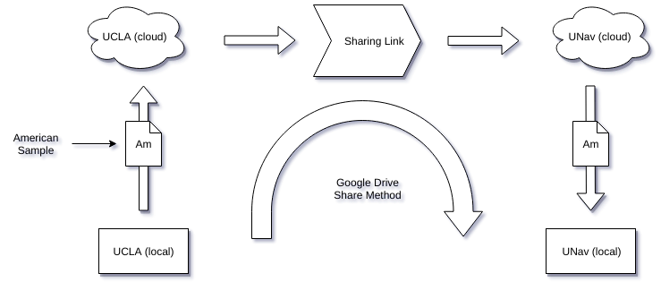

-   *Higher Security, Scalability and Sustainability
    > *Cloud storage is less prone to data losses and, even for those rare cases, constructing regular backups is not an issue. It also makes it easier to scale for more space with close to no modifications to current local setup since most of the backend is handled by the cloud storage platform.

Nephos will allow system administrators to utilise the features and assets of cloud with the convenience of least manual operational load. It will have a set of configuration files (detailed in their respective sections) to manage all recording jobs and schedules, and these configurations can be modified without disturbing the running state of modules.

Why Do I Want To Build Nephos?
------------------------------

### Why Nephos?

CCExtractor is used for (alongside other tools under [*Red Hen Lab*](http://www.redhenlab.org/)) research on multimodal communication, and the process of acquiring as well as storing (locally available) channel samples is a crucial step of this process. To prepare a client to automate the transmission of large chunks of data; from indexing files by a unique identity, applying the required pre-processing methods and then uploading the samples is an intriguing and challenging task.
The project is a remarkable choice to spend time on in summer due to two reasons. Firstly, the project has a direct impact on the way samples are managed and utilized at top Universities of the world. This in itself is a chief incentive which can single-handedly drive me to develop such a product.
Secondly, Nephos provides a lot of learning opportunity and a taste of implementation of concepts of making scalable software. Implementation of each sector (defined as a single functionality in the module) requires getting acquainted with multiple techniques, technologies, and libraries, and deploying them to create an efficient and (mostly) automated recording and uploading client.

### Why CCExtractor?

Choosing CCExtractor as the organisation to work with during summers was a choice motivated by multiple but two major factors. Firstly, the metamorphosis of CCExtractor from a tiny personal-need project to something being used by the world to push computing into another era of advancements is an incredible feat. Whenever people ask me why I’m trying for a small organisation like CCExtractor, I find pleasure in telling them the history of CCExtractor and how it has so much importance.
Secondly, the fact that the CCExtractor community is very responsive, helpful and guiding to new contributors. I have worked with one organization before CCExtractor and that community’s communication is no match to the swiftness experienced in doubt removal and learning in CCExtractor.

Proposed Deliverables (during GSoC)
-----------------------------------

1.  **Nephos, a Linux client with following functionalities:**

    1.  Timing based recording of TV streams.

    2.  Sample tagging by content (language, channel name, and channel ID).

    3.  Pre Upload processing like conversion to MP4 and subtitles extraction.

    4.  Automatic sample uploading.

    5.  Simplified sharing.

    6.  An interface to embed any cloud storage platform (Google Drive initially).

    7.  A minimalistic command line interface for the ease of use of the client and also set it up the first time.

2.  **A synced (with GitHub repository) pip installable PyPi package of Nephos.**

3.  **Tests and Continuous Integration (using Travis CI) tools.**

4.  **Detailed documentation; for users as well as developers.**

5.  **Fortnightly blogs on developmental advances and milestones.**

Brief Tentative Working
-----------------------

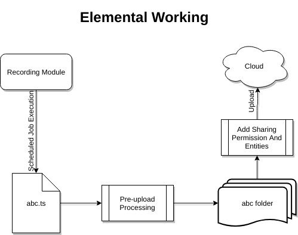

Nephos will be working on multiple levels and providing functionalities that will do recording, processing, uploading and sharing of samples. Below is a step by step explanation of what Nephos will be doing:

-   Nephos will be handling the recording processes of streams. The list of recordings to be done will be saved in a recording list file, where it can be easily edited, manually or with the included command line interface. The dataset that’ll be required for a recording is; channel ID, channel name, stream URL, and schedule.
    > 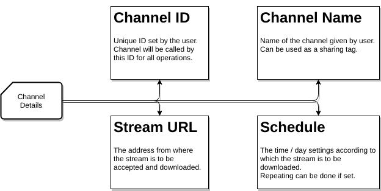**
    > **
    > Once a recording is complete, it will be saved in a folder named with “ID” of the channel. Since ID for every channel will be unique, the chances of folder name clashing will be eradicated.

-   As soon as sample recording is finished and the file is saved on to the local storage, the file will be put through set pre-upload processing. These pre-uploading tasks are:

    -   **Attachment of tags**: Every sample will get a set of tags associated with it. These tags can be used to facilitate operations such as share samples of “X” channel name or “X” channel ID. The tags can include (but can be expanded based on the metadata available) language, channel name, and channel ID.

    -   **Extract subtitles**: Subtitles from the sample can be extracted using CCExtractor with the arguments set in a configuration file, which can be edited manually as well as from the client interface.

    -   **Conversion to MP4**: Conversion to MP4 is a crucial part of the process, and there are many advantages of storing data in this format than the default .ts (transport format) in which the data comes. Below are some of these advantages, discussed in brief:

        -   MP4 is a more flexible and widely supported video container than ts (transport stream).

        -   MP4 uses a better compression algorithm and hence occupies a lot less disk space than ts files of comparable quality.
            > Below is the quality and size comparison of a ts file converted to MP4.

> 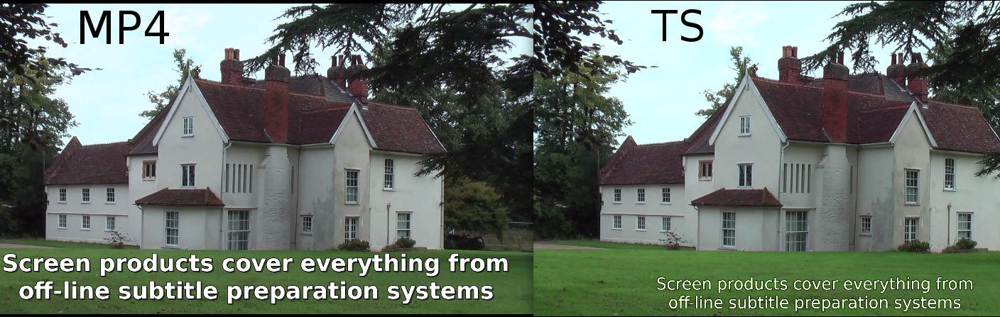
>
> Left Video::
> Type: MP4
> Subtitles: Using CCExtractor
> Size: 47.7 MBs
>
> Right Video::
> Type: TS
>
> Subtitles: Closed Captions
> Size: 84.8 MBs
>
> The video and subtitles files used above can be found [*here*](https://drive.google.com/open?id=13PfcCkWBXhQf2rv2x9yFfpbVVaFBRIey).
>
> The result of multiple such test conversions gives a ***compression ratio ***
>
> ***of about 50%***, which is, in any case, a huge saving of bandwidth and
>
> space.
>
> Also, the time taken to convert the above file using [*FFmpeg “*](https://trac.ffmpeg.org/wiki/Encode/H.264#crf)[**veryfast**](https://trac.ffmpeg.org/wiki/Encode/H.264#crf)[*” preset*](https://trac.ffmpeg.org/wiki/Encode/H.264#crf) was 17 seconds ([*system configuration*](https://drive.google.com/open?id=136Zj3t5fTuHQVdv-qO2zklZFEdNCIxT8)), which is justified for a close to 50% file size reduction.
> ***NOTE:*** Using the “*veryslow*” preset for best compression is **not** an efficient choice since the **time taken was 5 minutes 48 seconds** and file size produced is 50.7 MBs. This anomaly in file size is exclusive to the sample shown above but, in other tests as well, the gain (roughly 6% at best) is not worth the extra time.

-   After completion of pre-upload processes, the file is uploaded to the concerned online storage (Google Drive will be supported initially). A set of tasks by Nephos during upload are:

    -   **Fetch Unique File ID**: Every file uploaded to cloud (eg. Google Drive) gets a [*unique file ID*](https://developers.google.com/drive/v2/reference/files), stored in its metadata, which can be used to perform various operations with the file. Nephos will associate the file ID with the file for immediate purposes.

-   To facilitate effortless sharing of samples between multiple instances of Nephos, the following method would be followed:

    -   Sharing will be eased by linking tags (language, channel ID or channel name) with accounts of the universities to share the data with. A configuration file will be maintained for this purpose and data can be saved as follows,
        > 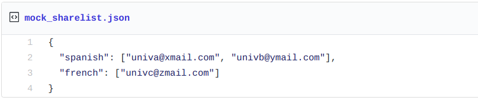

    -   During the upload process, it’ll be checked if the tags associated with the file present in the share list and accordingly permission will be appended to the file, assisted by the specific cloud storage API (elaborated in later part of the document).

Detailed Working And Implementation
-----------------------------------

### Major Dependencies

-   [**tvstreamrecord**](http://pavion.github.io/tvstreamrecord/) (**GPL v3.0 License**)

-   [**google-api-python-client**](https://github.com/google/google-api-python-client) (**Apache License v2.0**)

-   [**FFMPEG**](https://ffmpeg.org) (**LGPL v2.1 License**)

-   [**CCExtractor**](http://ccextractor.org/) (**GPL v2.0**)

-   [**Travis CI**](https://travis-ci.org) (**Free for open source projects**)

### Recording Module

[**tvrecordsample**](https://github.com/Pavion/tvstreamrecord) is a proof of concept (an external library) for the recording module; inspiration and parts of core recording code will be taken from there. The already present Nephos code (which will be studied thoroughly during the preGSoC and community bonding period) will be modified, appended or removed according to the implementation idea present below.
The purpose of this module will be to save tv streams coming through [*Real-Time Transport Protocol*](https://ffmpeg.org/ffmpeg-protocols.html#rtp), [*Real-Time Streaming Protocol*](https://ffmpeg.org/ffmpeg-protocols.html#rtsp), [*Internet Protocol Group Management Protocol*](https://en.wikipedia.org/wiki/Internet_Group_Management_Protocol) (in case of multicasting where a single packet is sent to many users) or other data streaming protocols, in a scheduled manner.

[*FFmpeg will be used*](https://github.com/Pavion/tvstreamrecord/blob/a3b843262e08a5c76ad6416e20da467657614fc8/tvstreamrecord.py#L1061) for recording the stream protocols it recognizes and can work with. Otherwise, we will [*use urllib2*](https://github.com/Pavion/tvstreamrecord/blob/a3b843262e08a5c76ad6416e20da467657614fc8/tvstreamrecord.py#L1100) or [*requests*](http://requests.readthedocs.io/en/master/) (if requests is more efficient and useful in the tests to be conducted during Pre-GSoC period).

The required parameters to start a recording will be channel address and schedule; a single channel address could be linked to multiple schedules and each scheduled recording will be saved with a name concatenating channel name and starting date and time, as this will be unique for a recording.

Recording module will be perpetually running since it will have to execute recording jobs. Thus for managing the schedules, it is important to take into account the local timezone ([*proof of concept*](https://github.com/Pavion/tvstreamrecord/blob/master/timezone.py) and result below) and afterward, using system time and recording jobs list, jobs will be initiated and stopped accordingly ([*proof of concept*](https://github.com/Pavion/tvstreamrecord/blob/a3b843262e08a5c76ad6416e20da467657614fc8/tvstreamrecord.py#L965)).

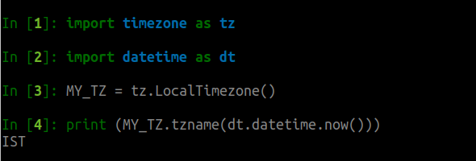

### Processing Module

Once a sample has been saved in a folder, the “Processing and Uploading” module will come into play and this will have the following parts/functions implemented. A skeletal demo of folder handling operations of processing module and few operations of the uploading module is present [*here*](https://github.com/thealphadollar/GDrive_Sync), which uses [*PyDrive*](https://github.com/googledrive/PyDrive) (python wrapper for Google Drive API) to accomplish tasks like authentication, listing, uploading etc. Code samples from the same will be used to show the implementation of functions and tasks.

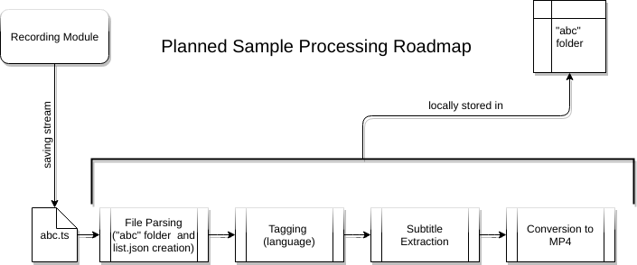

-   #### File parsing

When the recording module starts saving a stream, it’ll add the file path (since it’ll be unique) to “file\_list.json” (tentative title, present in the same folder) with “recording” value and filename as key. The purpose of this file will be to store the processing operation a file is going through. This will allow the client to sequentially process saved files without a clash occurring between two processes trying to use the same file at the same time. This will also facilitate the implementation of multiprocessing in the pre-processing part and hence, cut down the pre-upload processing time. Below is a diagram depicting the association of various file stages to keywords:

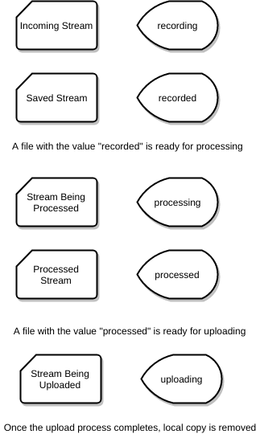

A stream with a “processed” value is ready to be uploaded as soon as the upload tasks begin as dictated by admin timing configuration. Below is a [*code snippet*](https://github.com/thealphadollar/GDrive_Sync/blob/205622d2a024cc19f79cced8b722868bdf388aa5/gdrive_sync/cron_handle.py#L32) which does the same but on a small scale.

The code below reads the list of file and checks whether the dictionary value of the file is set as True or False; True implies that it is being uploaded by a previous cron command (launched every 5 minutes and hence large files may be in upload when another instance is executed). If the value is False, it is added to the list of files to be uploaded and marked True subsequently. A new file added to the folder is instantiated with False value.
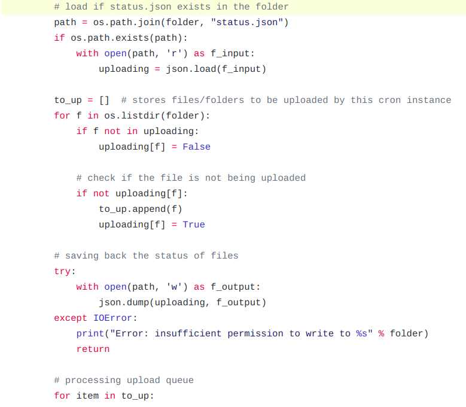
***NOTE:*** The file path is chosen as the key in the file\_list dictionary since any operating system does not allow having two files with the same full path. Hence, the file path is a unique key using which operations can be accomplished without collision and also an iteration over it can directly point to the needed files.

This process will also create a new folder inside the same directory. This folder will have the same name as that of the sample (this is allowed on Linux as shown below).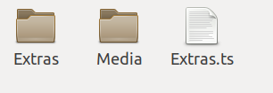

The structure of the sample storage folder will be similar to below path map.

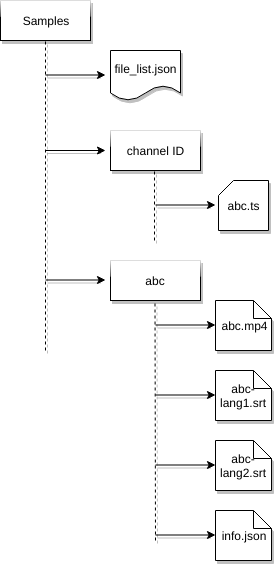

“info.json” stores information about the initially saved stream. Main components of the information list will be tags and file size. File size data will be used for sorting the files to efficiently pass the files into processes according to the time they are expected to consume.

-   #### Content Tag Association

Content tags to be associated with the files include subtitle languages available, audio languages available, the origin channel name and ID. These tags will be utilized in the sharing part of the uploading module.
Available subtitles’ languages can be parsed using FFmpeg’s [*FFprobe *](https://www.ffmpeg.org/ffprobe.html)module. Using this module also doesn’t increase the dependency count since the module comes bundled with FFmpeg library. The subtitle (or audio) language extraction process is simple and the code below demonstrates the same.
The [*sample*](https://drive.google.com/open?id=1gHkCOUscWM1i5wd5f73H4AW16Nn89DQ3) used contains multiple audio languages as well as multiple subtitle languages.

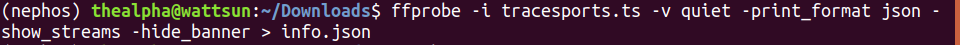

The above command outputs the information about all streams in a [*JSON format*](https://drive.google.com/open?id=1VuQ8V_FqngYt50tHMPc5-qYwF-XX4xfz). Further, this information can be easily read using a python dictionary and language information can be extracted as shown below.
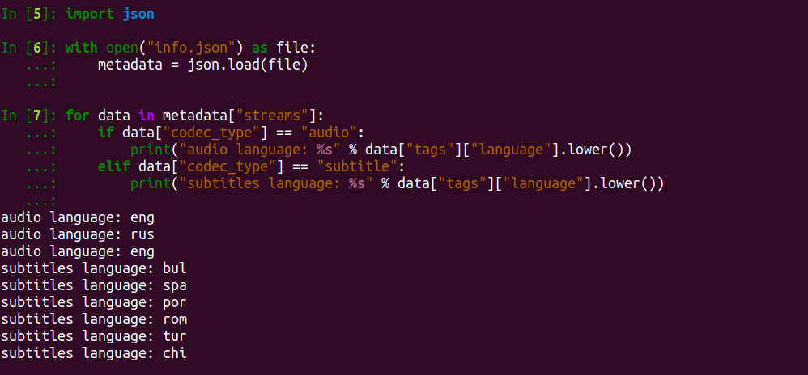

***NOTE:*** The same method can be used to associate accurate size to the file.

-   #### Subtitles Extractions

Subtitles extraction is an operation done with the help of CCExtractor and ffprobe. The list of subtitles’ languages (for a file) grabbed with the help of ffprobe can be traversed and used with CCExtractor’s “-dvblang” and “-ocrlang” parameters.

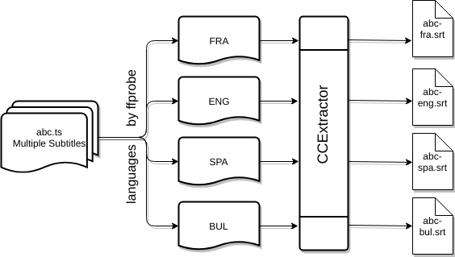

-   #### Conversion to MP4

Conversion of video files to one container from another can be [*achieved with FFmpeg*](https://opensource.com/article/17/6/ffmpeg-convert-media-file-formats) ([*proof of concept*](https://github.com/senko/python-video-converter/blob/master/converter/ffmpeg.py) that FFmpeg library can be integrated directly into python scripts. Note that this is an external project with no personal involvement). We will be using the MP4 container with *H.265* (High Efficiency Video Encoding) video compression standard and *AAC* (Advanced Audio Coding) audio compression standard. As mentioned previously, the container (with stated video compression standard) offers a compression ratio of more than 50% without any noticeable change in quality.

The choice of using [*H.265 standard*](https://wolfcrow.com/blog/understanding-mpeg-2-mpeg-4-h-264-avchd-and-h-265/) was made due to its improved compression algorithm which offers up to two-factor compression at the same quality compared to latest formats like AVCHD. It also supports resolutions up to 8K UHD which ensures long-term support (though won’t be of any use in near future). AAC standard was [*chosen against*](https://beebom.com/aac-vs-mp3/) the much popular MP3 format since at a smaller file size it is able to deliver a better sound quality and since space is a consideration, it’s only wise to use AAC.

Using the FFmpeg library, this can be achieved by embedding a code (using Python’s subprocess function) similar to the following command in the processing module after subtitle extraction since the MP4 format sample will not contain closed captions and will depend upon the extracted subtitles.

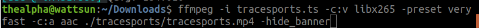

***NOTE:*** Size of [tracesports.ts](https://drive.google.com/open?id=1k-WuioSlMJsREV18Q18G4_KD1zaeHhiR) = 117 MB

Size of [tracesports.mp4](https://drive.google.com/open?id=1k-WuioSlMJsREV18Q18G4_KD1zaeHhiR) = 33 MB

Once the MP4 file is successfully generated, the original saved stream will be removed from the storage and from here on, file will be marked “processed” and is ready to be uploaded as soon as the upload module is started.

### Uploading Module

Uploading module will be using the respective cloud storage APIs. Most of these APIs are based on the REST (REpresentational Stateless Transfer) API architecture and the best part about using it is that it is highly scalable in the sense that the requests don’t need to carry the state of the session (hence stateless). For instance, even after 100 modifications, the data carried by the requests are roughly same as the first request. This is achieved by storing the session data on the client side, which in this case will be the system running Nephos.

An example of storing state on the client side is the authentication process we will be implementing. The authentication process (for Google Drive) will use [*OAuth 2.0*](https://developers.google.com/api-client-library/python/guide/aaa_oauth) and invoke [*drive.file*](https://developers.google.com/drive/v3/web/about-auth#OAuth2Authorizing) scope of access to write and manipulate only the files created by the application itself. To authenticate the application, system admin will have to open the generated authentication link, grant access and then the access tokens will be saved in “credentials.json” for making subsequent requests. A small-scale prototype of the same has been [*deployed in the demo*](https://github.com/thealphadollar/GDrive_Sync/blob/95ebdd7c37435808141feafb1c364633b214ccc0/gdrive_sync/auth.py#L16).

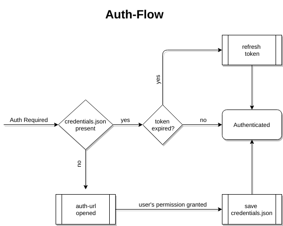

[*Google Drive API v3*](https://developers.google.com/drive/v3/web/about-sdk) will be used in the creation of the first uploading module for Google Drive. It enables two very crucial elements of the uploading module; upload and share using the [*drive\_service.files().create()*](https://developers.google.com/drive/v3/reference/files/create) and [*permissions.create()*](https://developers.google.com/drive/v3/reference/permissions/create) functions respectively.

-   #### Uploading

The local sample folder will be uploaded in the same file structure as it has been saved.

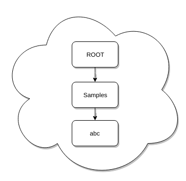

Google Drive [*handles folders*](https://developers.google.com/drive/v3/web/folder) in a similar way to files, the only difference is that for folders mimeType = application/vnd.google-apps.folder. Once a folder has been created, it’s file\_id can be used to create files/folders inside it using 'parents': \[folder\_id\] under file\_metadata. A recursive function which does the same, in the prototype mentioned earlier, is [*here*](https://github.com/thealphadollar/GDrive_Sync/blob/205622d2a024cc19f79cced8b722868bdf388aa5/gdrive_sync/file_ops.py#L132).

Taking into consideration the large size of samples to be uploaded, we will be using the [*resumable upload*](https://developers.google.com/drive/v3/web/resumable-upload) method. It allows resuming uploads and also lowers the bandwidth used in case of an interruption since the file upload need not be restarted.

-   #### Sharing With Set Entities

Sharing of the sample will be implemented through [*creating permissions*](https://developers.google.com/drive/v3/web/manage-sharing) in the file metadata before the file is uploaded. Entries from the share list will be used here to add the particular user to the sample with the required tags. A skeletal code sample for the addition of sharing permissions is below ([*source*](https://developers.google.com/drive/v3/web/manage-sharing#examples)).

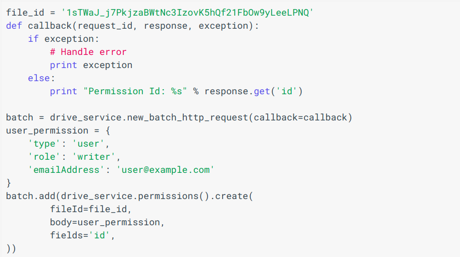

### Exception Handling

In each module there is possibility of systematic errors, and these need to be contained for full automation. Apart from maintaining error logs, Nephos will be programmed to catch errors and reroute the process automatically (wherever possible). Below is a brief (and non-exhaustive) discussion on error handling.

-   #### Network Issues

Internet connectivity is vital for the execution of scheduled jobs in recording module and error in connections would be reported as soon as they are detected. On failure of a job, user will be informed (in a way which will be decided after discussion with the mentor) and if it’s not a periodic task, it’ll be removed. In context of uploading module, uploads will be paused and resume once the connectivity is restored. Nonetheless, in both the cases, information will be made available to the user and logged as well.

-   #### Non-availability of space

Storage issues will have an impact similar to network issues on the recording module since it is scheduled according to time. Processing module can be halt till space is available and revert changes it made to the particular file (in terms of tag, which has been discussed earlier). To slim the chances of these errors, a periodic check will be done (say, every day) and the admin will be informed if the space is lower than a threshold.

-   #### Dependency Issues

Since we will be using same parameters for all similar sample types, it is obvious that many a times processing module can throw errors. Handling these errors, caused by passing of incompatible arguments to CCExtractor or FFMPEG modules, will be done by reporting them and instructing the admin to manually fix these errors (similar to git merge conflicts).
***NOTE:*** There is room for improvement in this method and a set of arguments can be put up to handle different types of samples. This can only be detailed and implemented during testing phase of processing module.

-   #### Incorrect Input

Human errors can be eliminated by settings strict input formats and prompting if a shift from that is detected. The input stream address will be verified using establishing a temporary connection and observing it’s return type (eg. 404 for link not found). A similar check using smtp protocols will be implemented for the verification of existence of an address put in the sharing list ([*demo code*](https://gist.github.com/thealphadollar/4079e751b8bfe48b8182a95bad0e6c1c)).

### A Parallel Processing Approach

To leverage multiples cores present in modern CPUs, we will make use of Python’s [multiprocessing module](https://docs.python.org/3/library/multiprocessing.html). The choice of using multiple processes in place of threads was made due to [*GIL*](https://wiki.python.org/moin/GlobalInterpreterLock) (Global Interpreter Lock), which only allows execution of a single thread at a time even on systems with multiple cores. So, the basic difference between python multithreading and multiprocessing is that while multithreading is concurrent, multiprocessing is parallel.

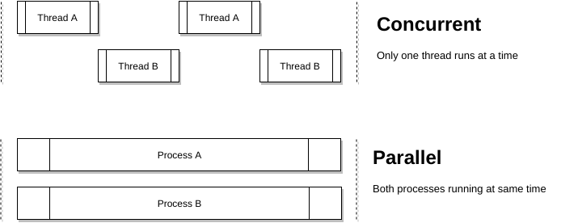

Benefits of multiprocessing can be reaped in tasks such as the creation of folders for a sample, subtitles extraction, video conversion; all in all each sample can be processed as a single process. To facilitate this, we will sort the sample list ascendingly according to size and run as many processes as the core count of the CPU, assigning each process a sample from the end of the sorted list.
In the experiments I did with this approach, the gains were huge in the upload time. My [*test samples*](https://drive.google.com/open?id=1of_pDcthYzwmjWMd44tjhJlBorDP6zSF) include three different files (average 80 MB size) cloned to have a total of 8 files ([*code*](https://gist.github.com/thealphadollar/fcd771b97eafc34efd534a49e2475d2d)). Using sequential upload under PyDrive and then parallel upload using eight simultaneous connections yields the following result:

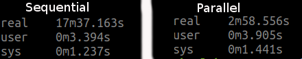

Keeping all the parameters same and no background tasks running, upload time was trimmed from 17 minutes 37 seconds to 2 minutes 58 seconds. Though the processes are not CPU intensive, they are IO bound tasks and most of their time is wasted waiting for the network. At this point, if these tasks run in parallel, that waiting time can be compensated for by other processes utilizing the free bandwidth.

### Nephos Abstract Base Class

To make it easier to integrate various cloud storage services into Nephos when needed, an [*Abstract Base Class*](https://docs.python.org/2/glossary.html#term-abstract-base-class) approach will be used. This base class will be inherited by specific cloud storage classes to implement their proprietary functions. Under this ABC, there will be two type of functions:

-   **Independent functions**: These will perform tasks independent of the cloud storage API, tasks such as removal of sample post-upload. These will be directly inherited by base classes with no overriding.

-   **Cloud-service specific functions:** These will be placed into the ABC to fix a skeleton for the specific classes that will be created and to maintain a standard across the implementations. [*Here*](https://gist.github.com/thealphadollar/26fdc4d5f31f9519820c94331061132b) is a short example of the same.

This approach will allow quick integration of new cloud storage APIs since the base will always be the same and just a few functions will require implementation. Another benefit of this is that it highly reduces the chances of missing the implementation of an important definition in specific Cloud Storage classes.

### Cron jobs handling

python-crontab will be used to manage and modify cron files in the system. Since the recording module will be full-time on the run, cron will be used to handle the processing and upload tasks using the sample list and the configuration files. Processing and upload module will be set to run every 15 minutes and check for new files in sample list whose recording has finished and are ready to be processed and later on, uploaded.

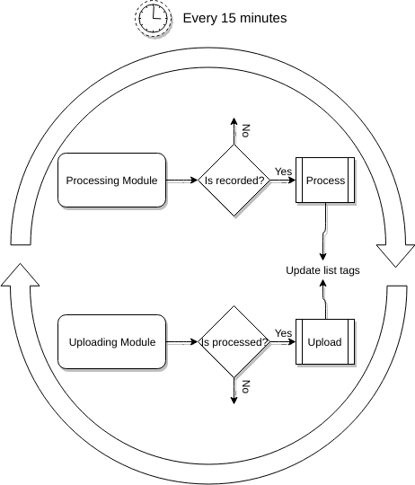

### Local Configuration Panel

A command line interface will be provided to manage and configure Nephos processing and upload module. Among the options that can be configured, there will be cloud storage details, timings for recording, processing and uploading to begin, sharing configuration et cetera. The configuration (a better option may be used if necessary) will be saved in a “config.ini” file which will be parsed using a [*combination of JSON and configparser*](https://stackoverflow.com/a/9735884/9044142) functions. The combination has been chosen since “ini” files are very handy to manually edit while JSON gives added functionalities such as handling lists as values.

A simple [*implementation*](https://github.com/thealphadollar/GDrive_Sync/blob/68f7fa906f6dc24dbec54a145a1cb562ea70dfbe/gdrive_sync/edit_config.py#L185) of this could be seen in the prototype mentioned earlier. It allows the user to set multiple parameters and then populates the configuration file with the new data to be used in future operations. Below is the command line console that appears to the user.

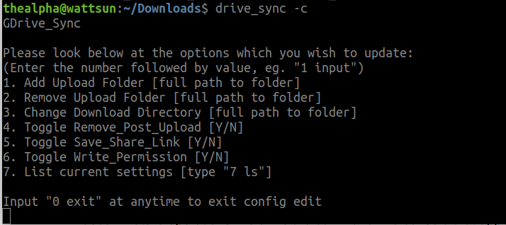

We will not be using environment variables since there will be a need for restart if the file is edited manually while Nephos is running. Hence, each time configuration data is required it’ll be directly fed from the file.

Brief Timeline
--------------

-   (Phase 0) Till 23 April: Pre-GSoC Period

-   (Phase 1) 24 April - 13 May: Community Bonding Period

-   (Phase 2) 14 May - 11 June: Coding Period 1

-   (Phase 3) 12 June - 15 June: Phase 1 Evaluations

-   (Phase 4) 16 June - 9 July: Coding Period 2

-   (Phase 5) 10 July - 13 July: Phase 2 Evaluations

-   (Phase 6) 14 July - 14 August: Coding Period 3 and Mentor Evaluation Submission

-   (Phase 7) 14 August - 21 August: Final Evaluation

Detailed Project Timeline
-------------------------

### Phase 0 \[Pre-GSoC Period\]

-   #### 3 Weeks (28 March - 18 April)

I’ve been spending time at understanding the codebase and solving issues concerning major issues. During this period, I’ll try to solve more tasks and also focus on solving some of the GSoC qualification tasks.
Along with that, I’ll carry on my experiments and demos with various technologies being used to gain a deeper understanding of the same.

-   #### 1 Week (19 April - 27 April)

End semester exams begin at my institute, and I will not be contributing actively during this period. Nonetheless, I’ll be actively following the progress and participate in conversations over slack.

Reference: [*Institute’s annual calendar*](http://www.iitkgp.ac.in/files/acad_cal1718.pdf)

### Phase 1 \[Community Bonding Period\]

-   #### 2 Weeks (28 April - 13 May)

During the community bonding, the main focus will be to frame a roadmap for the project with the guidance of the mentor (along with improving bonding, which is what the period is for). This period will also be used to study the already present work on Nephos and to figure a concrete plan to integrate that into the planned ideas and *tvstreamrecord*.
The integration of various parts of the project into one another will be framed, and a source code directory layout will be prepared to keep the flow smooth in later stages of the development.

All the development related setup will also be done during this period.
***NOTE:*** Once into the coding period I will be following the order; the recording module, the processing module and the uploading module, in the development process. Though the modules are independent, it’ll be useful to follow the order above since, in Nephos, each module requires the output of the previous.

### Phase 2 \[Coding Period 1\]

-   #### 3 Weeks (14 May - 4 June)

I’ll be merging parts of codes from tvrecordstream and already present work on Project Nephos. Since tvrecordstream is a fully functional standalone recorder, it’ll be kept as the base and elements from Nephos will be modified to work with it (more details will be shared after in-depth study of both the involved works).

-   #### 1 Week (4 June - 11 June)

During this week, I’ll be writing tests for recording modules. These tests will also be employed in continuous integration. This period will also be used as a buffer to complete documentation and fix bugs in the program.

### Phase 3 \[GSoC Phase 1 Evaluations\]

This period will be used to write a detailed report on the work done in Coding Period 1. All the work done will be uploaded and documentation will be created/uploaded to CCExtractor’s wiki.

#### Deliverables

-   Recording monitor capable of accepting channel data (through CLI), executing scheduled jobs and saving the stream.

-   Full documentation regarding usage and code.

-   Tests for the recording module.

### Phase 4 \[Coding Period 2\]

-   #### 2 Weeks (16 June - 1 July)

Work on processing module will begin; the main task during this period will be the collaboration between all the tools being used and the implementation of parsing the file\_list to avoid a collision. The linkage between the recording module and the processing module will be an integral part of the work.

Work on uploading module will also begin by the end of this period, though no documentation, tests or working will be presented.

-   #### 1 Week (2 July - 9 July)

Writing tests, documentation and other work, same as the last week of the coding period 2. Here, the tests will also be written for the combined functioning of the two modules completed until this phase.

### Phase 5 \[Phase 2 Evaluations\]

A detailed report on the working of the processing module and both the modules together.

#### Deliverables

-   Processed sample output files which includes subtitles, MP4 converted sample ,and associated tags.

-   Full documentation of the processing module and combined working of both the modules finished till now.

-   Tests for both modules, individually as well as functioning together.

### Phase 6 \[Coding Period 3\]

-   #### 3 Weeks (14 July - 7 August)

Work on Uploading module, which is the creation of Nephos abstract base class, a CLI for editing share-list and implementation of it in using Google Drive API, will be continued during this period. This will also require substantial testing of uploading/sharing functionalities and creation of tests for the same will start in this period only.
Integration of Nephos into Red Hen will be done during the last week of this period. The work to be done is unclear at the moment and will be decided after access to Red Hen is granted during GSoC period.

-   #### 1 Week (8 August - 14 August)

I’ll work on Travis CI automatic PyPI deployment, the creation of tests and writing the final documentation for the module as well as the entire project. As with the last week of every coding period, bug fixes and other minor changes will also be done along with the creation of Developer’s documentation to help integrate other cloud services.
This time will also be utilized to finish any pending works in the project, complete all documentation, write Wikis (if needed) and submit mentor evaluation.

### Phase 7 \[Final Evaluation\]

All documentation, modules, and tests will be uploaded and CI will be integrated into the project Github page.
***All the deliverables promised for GSoC will be provided by this stage.***

Additional Information Regarding Timeline
-----------------------------------------

-   The above timeline is tentative and gives a rough idea of my planned project work. I’ll try to keep progress at, at the very least, the proposed schedule. A more detailed schedule (after gaining in-depth understanding of technologies used) will be planned during the pre-GSoC and community bonding period and shared with the mentor.

-   I’ve no other commitments during summer and hence, will be able to dedicate 49 hours to 56 hours a week. During the last month of the project, my college will begin and I’ll be able to denote a max of 28-30 hours a week. Due to the same, major portion of the work will be done before this period.

-   Each week, time will be divided (according to workload) amongst planning, learning, coding, documenting and testing features. Except for the developer’s guide, all documentation will go hand in hand with the development. This will help to keep a profound grasp over the code implementation and working, minimizing bugs in the later stages.

-   Weekends will be mostly dedicated to testing, bug fixing, and blog writing. Fortnightly blogs will be maintained at [*https://medium.com/@thealphadollar*](https://medium.com/@thealphadollar) and will include highlights of the development process and also methods used to overcome hurdles.

-   One of the reasons I’ve been active in CCExtractor is due to the immensely helpful community and I’ll try to keep myself continuously updated with other developments going on. I’ll be available for communication at all times decided by my mentor and discuss new ideas and methods throughout the project.

-   I’m very enthusiastic about working on CCExtractor’s main code as well and will be taking up issues (outside my GSoC project) as and when time permits.

Tentative Spare Tasks
---------------------

The above timeline has been made with keeping in mind the maximum time any task could take and the worst case scenario of having a lot of bugs. Most probably, the work will be done before the end of the GSoC period and hence I would love to work on the below-mentioned tasks. I would be working on first and the last irrespective of GSoC selection.

-   ### Overhaul CCExtractor’s Documentation

With the help of my mentor, I would like to revamp CCExtractor’s wiki and documentation and follow standardized guidelines to create documentation for developers as well as users. Documentation is a crucial component of any project which helps newcomers start contributing quickly and I feel we need improvement in that aspect (though an active and helpful community compensates it at slack).

-   ### Integration of Dropbox API

To create documentation for developers to embed other cloud services into the Nephos API, a textual tutorial showing step by step integration of Dropbox API will be made. This will make it a cakewalk to integrate other services.

-   ### Resolve CCExtractor Bugs

There are a lot of bugs currently in CCExtractor’s main module and due to this the development cycle has been slow. I’ll try to solve as many bugs as possible during the pre-GSoC period (mentioned in the timeline) and then try to solve more once my project has been completed. This is also a task I look forward to being doing perpetually and being involved in the community.

Requirements
------------

-   **Remote High-Speed Server**
    > A server will be required to carry out independent testing. It will also allow for more efficient and faster testing since the internet connection in India doesn’t have high average bandwidth and I’ll be required to process and download/upload large samples for testing purposes.

-   **Multilingual Samples**
    > The system will be responsible for extracting subtitles using various methods and parameters of CCExtractor. The multilingual samples will foster testing of these sections of the code as well as expose bugs that might be present in CCExtractor.

-   **Wiki Edit Access
    > **
    > I want to edit multiple pages and guides over CCExtractor to make it more friendly for a new person to start working with CCExtractor. For instance, currently, the installation instructions for CCExtractor and its various modules (ocr, hardsubx, FFmpeg) is vague and scattered around various locations. I would make a unified page for all the installation instructions and when which additional parameter is required during installation.

**Personal Information**
========================

Personal Details
----------------

I’m Shivam Kumar Jha, an undergraduate student at Indian Institute of Technology, Kharagpur (India). I had been fascinated by programming since I was 14; I have always believed that “coders are the sorcerers of the 21st century”. It conveys that they have the power to create tools for the upliftment of mankind and what better way to do so than open source contributions. My experience with open source is relatively small but it has been so exciting that I’ve been contributing to multiple projects once I got acquainted with the concept. It has been a steep learning curve for me. Open source contributions have made me realize the importance of documented and easy to understand the code.
I also have a little exposure to competitive coding and my codechef handle is [*thealphadollar*](https://www.codechef.com/users/thealphadollar).
I have a firm knowledge of C, C++, Python and basic acquaintance with web-development technologies such as HTML, CSS, and JavaScript. I’m awestruck by the way Python has overtaken almost all other languages in every development sector due to its simplicity and lesser development time. Python gives the developers the freedom to spend more time on innovation and less time on actual implementation, which is a major distinguisher from languages like C.

I use Ubuntu 17.10 along with PyCharm (exclusively for Python) and Visual Studio Code (for every other language) as my default editors due to the large repository of extensions they feature. For testing purposes, I have been using a Digital Ocean droplet which allows me to deploy changes to an independent environment and then analyze the effects.

Kharagpur Winter of Code Experience
-----------------------------------

I worked as a student developer in [*Kharagpur Winter of Code*](https://kwoc.kossiitkgp.in/stats/thealphadollar) conducted by [*Kharagpur Open Source Society, IIT Kharagpur*](https://kwoc.kossiitkgp.in/). It is an event spanning over December where students are allowed to work on projects of their interest.

I worked on a project under National Institute Of Technology, Durgapur, India. The project used python and pygame library. It can be found [*here*](https://github.com/NITDgpOS/AirHockey) and below is feedback about my performance from my mentor, [*Aniq Ur Rhman*](https://github.com/Aniq55).

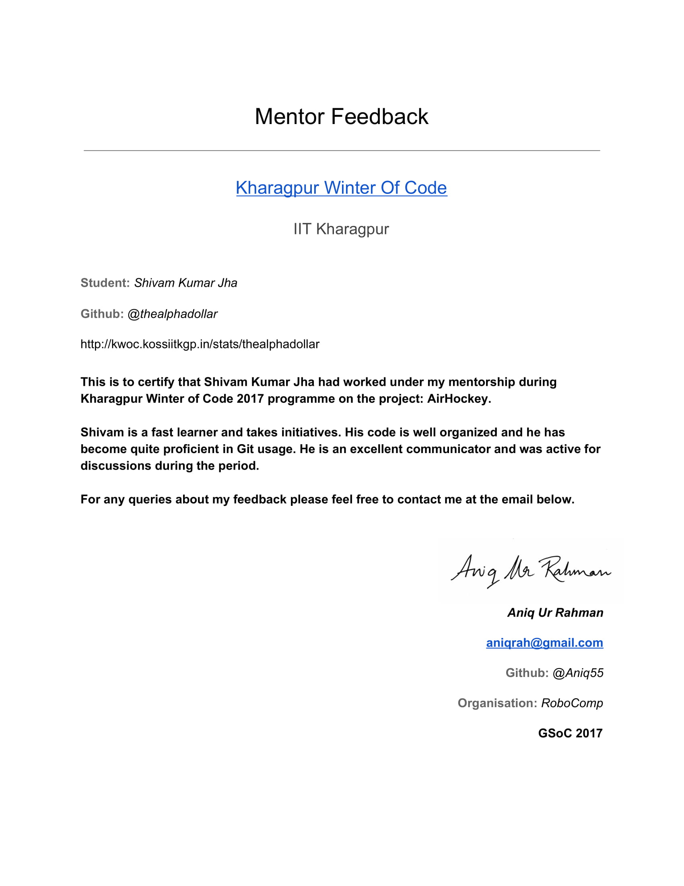

Working Environment And Schedule
--------------------------------

I’ll be mostly working full-time on the code on weekdays (Monday to Friday). On weekends, I’ll be focusing on documentation, testing and bug fixing. My awake hours would usually be in between 10 AM IST (4:30 AM UTC) to 2 AM IST the next day (8:30 PM UTC) and I’m comfortable working anytime during this period.
Except for a few days of traveling (which I’ll be informing in advance to my mentor), I’ll be having no other absences. Anyhow, in cases of emergency, I’ll responsibly notify my mentor of the same with enough detailing.

I’ll be initially working from home where I’ve constant internet connection but with a limited monthly allowance and hence I will need a high-speed server for processing, downloading and uploading large samples (mentioned in requirements). In the latter parts of the project, I’ll be working from my college campus which provides unlimited high-speed internet.

Communication
-------------

I’m very flexible with my schedule and already have the habit of working at night and hence timezone variation (with my mentor) won’t be an issue. I’m comfortable with any form of communication that suits my mentor. Below are the various options available:

-   **Email:** shivam.cs.iit.kgp@gmail.com

-   **Phone (Call, WhatsApp and Allo):** (+91) *hidden*

-   **Hangouts:** [*shivam.cs.iit.kgp@gmail.com*](mailto:shivam.cs.iit.kgp@gmail.com)

-   **Slack:** thealphadollar

-   **GSoC blogs:** medium.com/@thealphadollar

***
NOTE:*** The work on blogs will start at the beginning of the GSoC period (24th April) and the first post will be made regarding selection and abstract idea of the project.

Contributions (till 26 March 2018)
----------------------------------

-   ### [*Issues Opened*](https://github.com/CCExtractor/ccextractor/issues?utf8=%E2%9C%93&q=is%3Aissue+author%3Athealphadollar)

*Arrangement: Top is oldest*

-   [*\[PROPOSAL\] Compilation guide should have instructions to compile with OCR*](https://github.com/CCExtractor/ccextractor/issues/905)

-   [*\[BUG\] Error while using "-hardsubx"*](https://github.com/CCExtractor/ccextractor/issues/928)

-   [*\[GSoC 2018\]\[PROPOSAL\] Project Nephos Discussion *](https://github.com/CCExtractor/ccextractor/issues/945)

-   [*\[PROPOSAL\] Show quantisation mode used*](https://github.com/CCExtractor/ccextractor/issues/953)

-   *\[BUG\] No option to compile with HARDSUBX using cmake*

<!-- -->

-   ### [*Pull Requests Merged*](https://github.com/CCExtractor/ccextractor/pulls?q=is%3Apr+author%3Athealphadollar)

*Arrangement: Top is oldest*

-   [*\[IMPROVEMENT\] Update .gitignore *](https://github.com/CCExtractor/ccextractor/pull/906)

-   *\[IMPROVEMENT\] Code made compatible with Python 3 *

-   *\[IMPROVEMENT\] Modify -quant 0 option *

-   *\[FEATURE\] Display quantisation mode *

-   [*\[FIX\]-nocf not working with OCR'ing *](https://github.com/CCExtractor/ccextractor/pull/958)

-   *\[IMPROVEMENT\] Add LICENSE File *

-   [*\[IMPROVEMENT\] Update COMPILATION.md *](https://github.com/CCExtractor/ccextractor/pull/960)

-   [*\[FEATURE\] Allow build with hardsubx using cmake *](https://github.com/CCExtractor/ccextractor/pull/966)

Post-GSoC Plans
---------------

I’m **not** applying for GSoC under any other organisation this year since I am motivated by the journey CCExtractor has been through and I want to be an integral part of it.
I’ve already mentioned spare GSoC tasks and will be implementing them post GSoC (if not able to complete during the GSoC period). I’ll also be looking forward to contributing to the integration of Joker TV in CCExtractor. It was another project that fascinated me at the ideas page.
JokerTV is one of the next breakthroughs in the manner people watch TV and stream media. The sheer idea of a device that works around the time with all national standards is an exciting and groundbreaking milestone. In not much time, it’ll become an integral part of systems which make people consume media. Therefore, having support for it will help CCExtractor become more useful to the world.

I would love to work on its integration (in my spare college time) if the project is not done this time in Google Summer of Code. In case the project is completed this time, I’ll try to provide patches and bug fixes for it since I want to contribute to the project in some or the other way.
Along with that, I’ll always be a part of CCExtractor and will be following (as well as contributing towards) its development. I will always be available to make changes to Project Nephos and expand its feature set as and when need be.

**References**
==============

In the research and making of this proposal, multiple sources have been used and they have been hyperlinked at the place of their usage for ease of reading and verification.

All the diagrams were made with the help of [*draw.io*](https://www.draw.io)’s interactive editor.
I believe in Python’s way, “seek forgiveness not permission” and therefore, at some places self-deductions and experiments have been used to put results into the limelight. The experimental observations could vary between system setups and also give a different result (though very unlikely).
