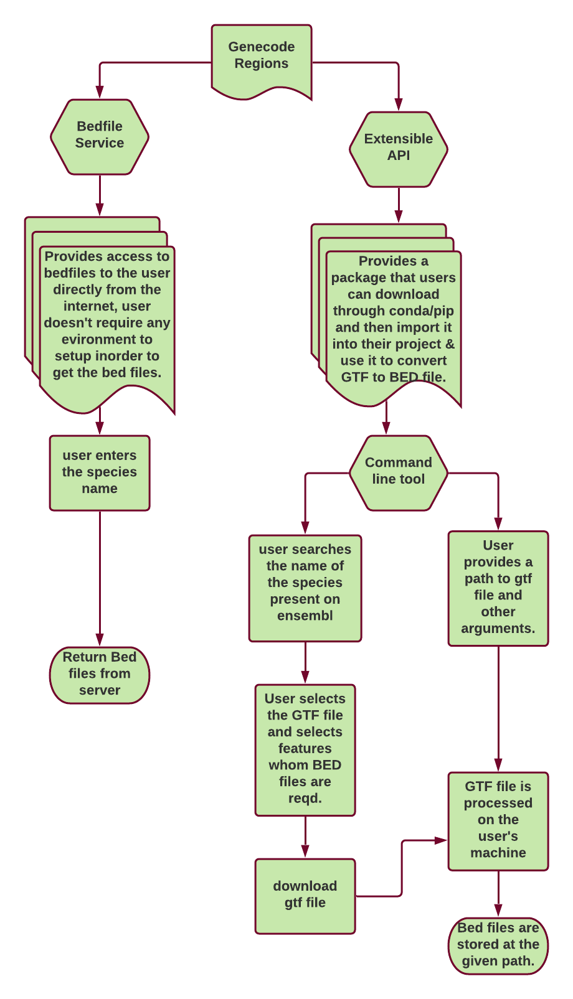

# 

## Personal Information

**Name** Tanishq Gupta

**Email** tanishq67@gmail.com

**University** Indian Institute of Technology, Kanpur

**Major** Biological Sciences and Bio Engineering (Bachelor of
Technology)

**GitHub** [<u>tanishq67</u>](https://github.com/tanishq67)

**Location** Ghaziabad, Uttar Pradesh, India

**Time Zone** IST( UTC + 5:30)

**Contact No.** (+91) 9953374024

# MENTORS

1.  **Saket Choudhary**

2.  **Amal Thomas**

# ABOUT ME & WHY I CHOSE THIS PROJECT 

# I am an undergraduate student in my second year at Indian Institute of Technology, Kanpur pursuing a Bachelor of Technology in Biological Sciences and Bioengineering. 

# I first got familiar with programming in my freshman year through the medium of the course ESC101 - Fundamentals of programming. Initially my performance was quite bad in this course as I was completely new to programming. But, within a few weeks, I started developing interest in it, so much that I was solving 4-5 problems daily and eventually got an A grade in the subject.

# My interest in programming didn't end there. During my summer break, I worked on multiple simple and small programming projects. During this time, I also came to know about the Game Development society of my College and joined it. There, I learnt game development and also developed a PC game using Unity and C\#.

# Then, I came to know about competitive programming. I started solving algorithmic programming problems on Codechef. I really enjoyed solving them, and also learnt various different algorithms during this time. Currently I have a highest rating of 1841 (4 star) on Codechef. Though competitive programming has little relevance to this project, it does show the problem solving aptitude of a student. 

# The first time I experienced real Object Oriented Programming was when I joined the web development team of Asia's largest tech fest TechKriti (Tech fest of IIT Kanpur). There I learnt web development, learnt how to find a solution online when you are stuck, how to debug large projects and gained a lot of practical skills. 

# At the same time from one of my teammates, I came to know about the Open Source and the Hacktoberfest. I contributed my implementations of various algorithms to a repository whose aim was to help students in courses like Data structures and algorithms with implementations of important Algorithms in multiple different languages. 

# Though I am in my sophomore year, I took a pre final year course of Computational Biology and Bioinformatics as I was highly interested in learning about it. I got so much engaged in it that I now aspire to become a Bioinformatics researcher in the future. 

# Later after finishing my TechKriti project, I again went back to opensource and started exploring it. I found a very famous organisation OPPIA Foundation and learnt about their platform that aims to provide free quality education to students around the globe. I joined their community and started exploring their platform. I reported a few bugs which I found and also helped them by adding new lint tests to make their code cleaner and better. From there only, I learnt about Google summer of code. I really liked the concept of GSoC and since I liked bioinformatics so much from my course, I looked for open source organisations related to Bioinformatics. Then, I came to know about OBF and from their website, I came to know about potential project ideas for GSoC'21 (though results for participating organisations were not released at that time).

# There I found that the GTF Base project is really interesting. I really liked the project from my first glance as it was quite relatable. It used a lot of concepts which I learnt from my course in last semester ESO206 - PRINCIPLES OF BIOTECHNOLOGY. I decided to try it out. I initially faced some issues in running the notebooks on the genecode_regions repository but I did not give up and found the solution. I even raised a Pull Request, so that others don’t face the same issues again. After learning more about GTF and Bed files, I realized why this project is actually very useful. 

# A lot of analysis in Bioinformatics requires BED files to work with, however, currently we don't have any existing database of BED files nor a modular script which can convert GTF files (standard) to Bed. Though it is trivial to obtain a BED from GTF but it does require time and I think this project can save a lot of time for people doing research work in this field and maybe they can utilize this saved time in a more productive way.

# 

# PROJECT DESCRIPTION

1.  Each genome has some common features: exons that make the mRNA,
    > coding domain sequence (CDS), and untranslated regions (UTRs) that
    > are located both towards the 5’ and 3’ ends of the transcripts.
    > ENSEMBL (http://ensembl.org/), Gencode
    > (https://www.gencodegenes.org), and NCBI
    > (https://www.ncbi.nlm.nih.gov/) are some of the key available
    > resources that provide access to these features in the form of
    > General Transfer Format (GTF) files
    > (https://uswest.ensembl.org/info/website/upload/gff.html). While
    > GTF files are by themselves comprehensive, a lot of analysis is
    > focused on individual features. For example, any analysis focused
    > on transcriptional regulation would focus more on exons and
    > possibly introns and non-coding RNA than UTRs while translational
    > regulation analysis would focus on only the CDS and possibly the
    > UTRs. These analyses often require a BED file
    > (https://uswest.ensembl.org/info/website/upload/bed.html). Though
    > it is trivial to obtain a BED file from GTF, currently there are
    > no resources that provide ready access to BED files. Though the
    > GTF is supposed to be a standard format, there are differences in
    > the annotation features for different species.

2.  We have a collection of scripts currently available as part of
    > gencode_regions repository:
    > https://github.com/saketkc/gencode_regions that provides ready
    > access to BED files of 5’UTR/exons/CDS/3’UTRs across multiple
    > species. We plan to generalize these scripts into a usable tool
    > that can be used to generate BED files for a variety of use cases
    > and serve as a readily updated database of BED files that will
    > keep in sync with ENSEMBL’s GTF releases.

3.  Goals: The current codebase is in Python and makes use of gffutils
    > library for processing GTFs. The GTFs themselves cannot be assumed
    > to be free of errors and hence while processing we need to be able
    > to handle issues such as overlapping regions or infer missing
    > feature annotations from known features. The student will execute
    > the following:

    1.  Convert the existing scripts to a library with an extensible API
        > that can be exposed to command line

    2.  Create a modular pipeline that will use the above library to
        > create BEDs for GTFs of all organisms hosted on ENSEMBL:
        > https://uswest.ensembl.org/info/data/ftp/index.html

    3.  The following bed files should be supported at the minimum:

<!-- -->

1.  5’ UTR

2.  CDS

3.  Exons

4.  Introns

5.  Start codons

6.  Stop codons

7.  Non-coding RNA

8.  3’ UTR

9.  First exons & 10. Last Exons

.PROJECT ACTION PLAN

**Overview**

1.  Modularising scripts and adding structure to them

This is one of the crucial parts as it will make our library more
generalized and extensible. Currently, we have multiple Jupyter
notebooks, one for each species. Since all the notebooks use similar
code for generating BED files from a GTF file, we can remove this
redundancy and create a more generalized library which can handle any
GTF file. Converting the current notebooks into a modular library will
make the code more readable as well as easily extendable in the future.

To begin with, I think we can modularize the current code into a
structure similar to:

gtfbase/

├─ docs/

├─ gtfbase/

│ ├─ \_\_init\_\_.py

│ ├─ bed_tool_builder.py

│ ├─ consts.py

│ ├─ default_ordered_dictionary.py

│ ├─ ensembl_data_manager.py

│ ├─ gene_dict_builder.py

│ ├─ gtfbase_cli.py

│ ├─ utils.py

│ ├─ zenodo_utils.py

├─ .gitignore

├─ README.md

I will improve this as per our need and as things get more clearer
during the course of the project.

We will have one file (gtfbase_cli.py) with the main function that will
process the given command line arguments (user’s input) and call
appropriate modules to perform the processing, in order to create the
desired BED file(s).

Here, I am trying to move the independent parts out of the main function
and generalize the code. Some vital information about the various
modules listed above:

-   default_ordered_dictionary.py

> It will contain the class DefaultOrderedDictionary which we use to
> store information from a GTF file.

-   gene_dict_builder.py

> This module will contain methods to create a Gene Dictionary (of type
> DefaultOrderedDictionary) from a GTF file.

-   bed_tool_builder.py

> This module will contain methods to generate a **BedTool**
> ([<u>pybedtools.bedtool.BedTool</u>](https://daler.github.io/pybedtools/autodocs/pybedtools.bedtool.BedTool.html))
> object from a given Gene Dictionary.

-   ensembl_data_manager.py

> This module will contain methods to fetch data from Ensembl. It will
> use the FTP module to connect with [<u>Ensembl
> FTP</u>](http://ftp.ensembl.org/pub/). It will provide methods to get
> a list of available GTF files and also to download files from Ensembl
> FTP.

-   consts.py

> This module will contain constants used throughout the code.

-   utils.py

> This module will contain some general utility functions used by our
> library.

-   zenodo_utils.py

> This module will contain methods to upload and download files using
> [<u>PyZenodo3</u>](https://github.com/space-physics/pyzenodo3).

While modularizing the scripts I will be formatting them using the
[<u>Black formatter</u>](https://pypi.org/project/black/).

Since hosting a package is one of our end goals, we may need some
additional files as per the guidelines presented by bioconda for a
package. I will change the modules accordingly.

I am also thinking of adding some unit tests for various modules
described above, so that it becomes easy to test the functionality. It
will also help my mentors during the evaluation period to test and
recheck the working of the modules.

1.  CommandLine Tool

A really useful feature I will add is the option to use it as a command
line tool, which will make it even more convenient to use for everyone.
In order to implement this I will be using the
[<u>argparse</u>](https://pypi.org/project/argparse/) library or the
[<u>click</u>](https://pypi.org/project/click/) library. They are both
very popular and easy to use python packages for processing command line
arguments.

The user will have to add the path to the gtf file he/she desires to
work with, and then additional arguments like --features, which I think
is a really good idea as, this will also make our program efficient as,
let's say our user needs to work with only the exons and introns BED
file, then we don’t need to process and create all of the BED files. An
edge case can be that the user asks for some feature that is not present
in the GTF file, for example user enters 5’UTR, 3’UTR & some other
features, and those features are not present in the GTF like in the case
of MG1655 and sacCerR64. In such cases, we will process the request for
all valid arguments and for the invaild ones we can simply show an error
like this:

**””” argument 5’utr is invalid, feature is not present in the File
”””**

**””” argument 3’utr is invalid, feature is not present in the File
”””**

Below I have attached the tentative menu of the command line tool,

I have used argparse to create a prototype of the command line menu
which we will have.

From the above menu we can see that we will also have an interactive
mode which takes the command line tool’s user experience to a whole new
level with an easy to use interactive command line interface.

Inorder to switch to the interactive mode user just needs to put this
command:

**python gtfbase_cli.py --interactive**

I have implemented a prototype for the command line tool’s interactive
mode, Please check out the video here (google drive link):

[<u>https://drive.google.com/file/d/1My6nJVNJ6PGhpEavwGfIbphbcRKQahjD/view?usp=sharing</u>](https://drive.google.com/file/d/1My6nJVNJ6PGhpEavwGfIbphbcRKQahjD/view?usp=sharing)

In case you are having any issues in viewing the above video, I have
also described the flow with the help of some screenshots below:

This feature allows the user to choose any specific species’ GTF file
from the Ensembl database, select the required features and generate the
Bed files in a simple and hassle free manner.

Inorder to implement the above prototype, I have used two python
libraries:

1.  **simple_term_menu** which creates simple menus for interactive
    command line programs. It can be used to offer a choice of different
    options to the user. Menu entries can be selected with the arrow
    keys. One can also search something from the shown list of options
    which I think is very helpful for searching among hundreds of
    species.

2.  **ftplib** which defines the class
    [FTP](https://docs.python.org/3/library/ftplib.html#ftplib.FTP) and
    a few related items. The
    [FTP](https://docs.python.org/3/library/ftplib.html#ftplib.FTP)
    class implements the client side of the FTP protocol. I am using it
    for easy access to Ensembl FTP server. Most of the methods required
    to work with the Ensembl database will go to the file
    ensembl_data_manager.py as I described earlier.

Ensembl has its own FTP site with which we can download the files we
require.

With the help of the **ftplib**, I am able to access this site. The
Ensembl FTP site provides a directory *current_gtf* which contains all
latest GTF files of various species. So, we will get the list of species
from this directory and show it to the user on the terminal with the
help of **simple_term_menu**. We might also consider the python package
[<u>PyEnsembl</u>](https://github.com/openvax/pyensembl) for this
purpose. It uses the same Ensembl FTP internally for downloading the GTF
files. It also provides some methods to access different annotation
features from the GTF. But, since we already have the code for
processing a GTF file, it won’t be much useful. Also, the repository for
this is not very active and the last release was in 2017. Still, I will
explore the above library before GSoc and evaluate if we can benefit
from the functionalities it provides.

I have written a simple code snippet for the prototype. In the actual
code, I will place different functionalities in their respective
modules. And also add some error handling to make the code more robust
and free from runtime errors. Here’s the code for the above prototype:

<table>
<tbody>
<tr class="odd">
<td>from simple_term_menu import TerminalMenu 
from ftplib import FTP 
 
print("Fetching available species...") 
ftp = FTP("ftp.ensembl.org") 
ftp.login() 
ftp.cwd("pub/current_gtf") 
species_list = ftp.nlst() 
 
species_menu = TerminalMenu(species_list, search_key=None) 
menu_entry_index = species_menu.show() 
 
 
print("You have selected %s..." % species_list[menu_entry_index]) 
ftp.cwd(species_list[menu_entry_index]) 
file_list = ftp.nlst() 
gtf_files = [file_name for file_name in file_list if file_name.endswith(".gtf.gz")] 
 
gtf_file_name = gtf_files[0] 
if len(gtf_files) &gt; 1: 
print("Choose one GTF file:") 
gtf_menu = TerminalMenu(gtf_files, search_key=None) 
gtf_entry_idx = gtf_menu.show() 
gtf_file_name = gtf_files[gtf_entry_idx] 
print('%s file will be used...' % gtf_file_name) 
 
print("Choose features:") 
feature_list = ["CDS", "exon", "intron", "five_prime_utr", "three_prime_utr"] 
feature_menu = TerminalMenu( 
feature_list, multi_select=True, 
show_multi_select_hint=True, 
) 
menu_entry_indices = feature_menu.show() 
print("You have selected following features: {0}" 
.format([feature_list[x] for x in menu_entry_indices]))</td>
</tr>
</tbody>
</table>

In the prototype I have hardcoded the features. However in the actual
program, at the time of showing the options for features, we will
already be having the GTF available in our code, we can show only those
features which are available in the GTF as well as are supported by our
library. For this, we can list out the features in the GTF like it is
done in the notebooks currently (as shown in the below code snippet):

And then the selected features will be sent to our modular library and
will be processed and finally converted to the desired bedfile(s).

1.  Testing the library on multiple GTFs

Since, our library will support automatically downloading GTFs from
Ensembl. For testing, I will run this library through all the species
available on Ensembl and try to generate Bed files. While testing, if I
encounter any new issues with GTFs, I will fix them to make our library
more robust and free from unexpected crashes. Writing this test will be
trivial as we just want to get the list of all species on Ensembl and
loop through it, calling our library on each species.

The following code snippet shows how easily one can import and use our
library in their project for generating Bed files from GTF files
(tentative design):

<table>
<tbody>
<tr class="odd">
<td>
import gtfbase 
 
gtf_save_path = "~/felis_catus_latest.gtf.gz" 
species_name = "felis_catus" 
 
# If you don't already have a GTF, you can download one from Ensembl. 
ensembl_data_manager = gtfbase.EnsemblDataManager() 
ensembl_data_manager.download_gtf(species_name=species_name, 
save_path=gtf_save_path) 
 
# Once you have a GTF, build a Gene dictionary using GeneDictBuilder. 
gene_dict_builder = gtfbase.GeneDictBuilder() 
gene_dict = gene_dict_builder.build_gene_dict(gtf_path=gtf_save_path) 
 
# Generate BedTool objects for required features. 
bed_tool_builder = gtfbase.BedToolBuilder() 
bed_tool_dict = bed_tool_builder.generate_bed_tool_objects( 
gene_dict=gene_dict, reqd_features=['exon', 'five_prime_utr']) 
 
# You can use the generated BedTool for your work.

# Or you can save them as, 
for feature_name in bed_tool_dict: 
bed_tool_dict[feature_name].saveas('%s.bed.gz' % feature_name)
</td>
</tr>
</tbody>
</table>

I will also test individual modules like *EnsemblDataManager* to ensure
that they are working fine and can handle unexpected situations.

1.  Converting everything into a Bioconda package

After having working modules, in order to make it easy to use and
extensible, I will be converting it into a complete package/library
which one can download from conda.

I will be converting my package in the form of a bioconda recipe and
then hosting my package on
it.

Then with the help of a simple command, like in the one below, one can
download and import it into their project.

**conda install -c bioconda gtfbase**

This library will be open source and we will be having a github
repository for it. The benefits of having a library will be that it can
easily be extended and users can easily incorporate them into their
projects.

**Bed file Repository**

We also plan to provide the desired BED files to users across the world
at any time via an easy to use free service on the internet.

For this service we will need a database and in that we will be storing
BED files for a lot of common species.

Please take a look at the below chart which clearly describes the
working of the service.

1\. Setting up a database for the
Repository

We will be hosting a database on Zenodo.

**Zenodo** is a general-purpose [open-access
repository](https://en.wikipedia.org/wiki/Open-access_repository)
developed under the European
[OpenAIRE](https://en.wikipedia.org/wiki/OpenAIRE) program and operated
by [CERN](https://en.wikipedia.org/wiki/CERN). It allows researchers to
deposit research papers, data sets, research software, reports, and any
other research related digital artifacts. For each submission, a
persistent [digital object
identifier](https://en.wikipedia.org/wiki/Digital_object_identifier)
(DOI) is minted, which makes the stored items easily citable.

This database will be holding the BED files of all the commonly used
species, and can be easily downloadable.

2\. User Interface for the Web Page

Initially I will be writing the interface in plain HTML. Basically we
will be having a table having the name of the species with the link to
download right next to it.

I will try to take the user interface to a much better level. For that,
I will be using Angular-9 to make it much more easy on eyes and
professional looking and the entire UI for the github page we will be
using to host our Service will look something like this.

After choosing:

A .json file will be kept in that github repository containing the
download link for each species name.

Something, like this -

<table>
<tbody>
<tr class="odd">
<td>speciesData = { 
"species_name1" : "link1", 
"species_name2" : "link2", 
"species_name3" : "link3", 
.... 
}</td>
</tr>
</tbody>
</table>

Now, all I require is to iterate through this list searching for the key
= “desired species”, and when found, return that link.

Since, designing UI is trivial and doesn't require any sort of
challenges I will be focusing on the other goals and will keep it as a
POST SOC or will complete it in the Buffer time if I am able to complete
everything within time, I have described it in the timeline in detail.

Also in the past I made a result portal for a competition conducted by
our college which searches for the students' results using its login
credentials which was quite similar to our use case. ( Link to that
repository:
[<u>https://github.com/tanishq67/Result_Portal</u>](https://github.com/tanishq67/Result_Portal)
)

This makes it even easier for me to implement it.

**Documenting it**

Lastly, I will ensure that all methods have appropriate docstrings and
comments wherever required, so that it is easy for a new person to
understand our code and contribute to our library. I will add proper
documentation for the library, so that anyone who wants to use it, can
go through it and get started.

I think this part is really important though trivial, as with this
extending the library will become much more convenient for those who
want to use it as well as extend it and will save time for a lot of
great engineers and scientists. It will also help me showcase my project
properly.

Since the users of the Repository and Library are going to be really
great scientists and engineers, I don't want to idle their time. My
documentation will be concise and to the point while at the same time
explaining everything in detail.

Though the initial documentation will be written as a github ReadMe and
will be done in the markup language. I will also add a formal
documentation, created with the help of pydocs. Again, like the UI this
doesn’ t require a whole lot of intuition and henceforth I will be
shifting it for the buffer period or Post Soc period depending upon the
circumstances.

# 

# PROPOSED TIMELINE

## COMMITMENTS

My summer vacation starts by the second week of May, I don't have any
commitments during that time. Though, this time GSOC asks for 175 hrs,
however, as mentioned later in the “why me?” section, this **project is
really very important for me** and Hence, rather than part time I will
be **working full time** on it throughout the summer.

There is a speculation that my college will run in the summer ( I have
not heard anything formally from my college administration ), if however
this happen then I have to attend the 3 pending lab courses which were
not held in my 2nd year due to coronavirus, even in that case I only
have to give about 6 hr to the labs and still I will be having **6+
hours** for the project and during the weekends if required I will crank
it up to 8 - 10 hours easily.

Total time commitment for each week will be around **40 hours**.

## Timeline 

**Overview**

<table>
<thead>
<tr class="header">
<th><strong>Community Bonding Period</strong></th>
<th><ul>
<li><blockquote>

Get to know about OBF and mentors.

</blockquote></li>
<li><blockquote>

Discuss upon handling GTF files with my mentors.

</blockquote></li>
</ul></th>
</tr>
</thead>
<tbody>
<tr class="odd">
<td><strong>Milestone 1</strong></td>
<td><ul>
<li><blockquote>

Scripts completely Modularized

</blockquote></li>
<li><blockquote>

Command line properly functioning

</blockquote></li>
<li><blockquote>

Added functionality to fetch data from Ensembl

</blockquote></li>
<li><blockquote>

Generate .bed for all the species while pretesting

</blockquote></li>
</ul></td>
</tr>
<tr class="even">
<td><strong>Milestone 2</strong></td>
<td><ul>
<li><blockquote>

.bed file repository all setted up

</blockquote></li>
<li><blockquote>

Everything well documented

</blockquote></li>
<li><blockquote>

Library converted into Bioconda package .

</blockquote></li>
</ul></td>
</tr>
</tbody>
</table>

**In-depth**

<table>
<thead>
<tr class="header">
<th>
17th May - 6th May

<strong>Community bonding period</strong>
</th>
</tr>
</thead>
<tbody>
<tr class="odd">
<td><ul>
<li><blockquote>

<strong>Deliverables :</strong>

</blockquote>
<ul>
<li><blockquote>

Get to know more about OBF and my mentors

</blockquote></li>
<li><blockquote>

Discussing ideas for handling the .gtf and brainstorm to get the best possible method

</blockquote></li>
<li><blockquote>

Set up a blog for the weekly updates

</blockquote></li>
</ul></li>
</ul>
<ul>
<li><blockquote>

<strong>Challenges :</strong>

</blockquote>
<ul>
<li><blockquote>

handling of the GTF files (may require discussion with mentors)

</blockquote></li>
</ul></li>
</ul>
<ul>
<li><blockquote>

<strong>Comments :</strong>

</blockquote></li>
</ul>
<blockquote>

Since we cannot assume that the gtf files will be free of errors we do have to handle them while converting them to bed files. Though some notebooks have code written which handles some of the errors, however, there can be other possibilities as well.

(easy weeks)

</blockquote></td>
</tr>
<tr class="even">
<td>
7th June - 20th June

<strong>Modularize scripts</strong>
</td>
</tr>
<tr class="odd">
<td><ul>
<li><blockquote>

<strong>Deliverables :</strong>

</blockquote>
<ul>
<li><blockquote>

Scripts well modularised

</blockquote></li>
<li><blockquote>

Robust Library ready for any error in the GTF

</blockquote></li>
<li><blockquote>

GitHub repository for gtfBase (will be pushing changes on it throughout the project)

</blockquote></li>
</ul></li>
</ul>
<ul>
<li><blockquote>

<strong>Challenges :</strong>

</blockquote>
<ul>
<li><blockquote>

Making the library prepared for any error in the GTF

</blockquote></li>
</ul></li>
</ul>
<ul>
<li><blockquote>

<strong>Comments :</strong>

</blockquote></li>
</ul>
<blockquote>

In my “Action Plan” I have already mentioned how I will dissect the scripts.

(easy - medium weeks)

</blockquote></td>
</tr>
<tr class="even">
<td>
21th June - 28th June

<strong>Command line tool</strong>
</td>
</tr>
<tr class="odd">
<td><ul>
<li><blockquote>

<strong>Deliverables :</strong>

</blockquote>
<ul>
<li><blockquote>

Static menu using argparse/click

</blockquote></li>
<li><blockquote>

Implementation of the interactive part

</blockquote></li>
</ul></li>
</ul>
<ul>
<li><blockquote>

<strong>Challenges :</strong>

</blockquote>
<ul>
<li><blockquote>

Brainstorm, if we can add any feature that may be useful for the users

</blockquote></li>
</ul></li>
</ul>
<ul>
<li><blockquote>

<strong>Comments :</strong>

</blockquote></li>
</ul>
<blockquote>

The command line plan is very well built as I am quite familiarized with the topic and have also built a prototype for it.

(easy week)

</blockquote></td>
</tr>
<tr class="even">
<td>
29th June - 4th July

<strong>Add functionality to fetch data from Ensembl</strong>
</td>
</tr>
<tr class="odd">
<td><ul>
<li><blockquote>

<strong>Deliverables :</strong>

</blockquote>
<ul>
<li><blockquote>

Functionality to fetch data from Ensembl added

</blockquote></li>
<li><blockquote>

Implementation of it in the command line tool as well

</blockquote></li>
</ul></li>
</ul>
<ul>
<li><blockquote>

<strong>Challenges :</strong>

</blockquote>
<ul>
<li><blockquote>

To make it simple for the user to search a desired GTF from Ensembl

</blockquote></li>
</ul></li>
</ul>
<ul>
<li><blockquote>

<strong>Comments :</strong>

</blockquote></li>
</ul>
<blockquote>

As I have already chalked down how I will proceed it won’t be so hard to implement this.

(easy - medium week)

</blockquote></td>
</tr>
<tr class="even">
<td>
5th July - 11th July

<strong>Pretesting week and Preparation for evaluation 1</strong>
</td>
</tr>
<tr class="odd">
<td><ul>
<li><blockquote>

<strong>Deliverables :</strong>

</blockquote>
<ul>
<li><blockquote>

Library used on all the .gtf files present in ensembl’s current database

</blockquote></li>
<li><blockquote>

Simultaneously generating .bed files for the repository

</blockquote></li>
</ul></li>
</ul>
<ul>
<li><blockquote>

<strong>Challenges :</strong>

</blockquote>
<ul>
<li><blockquote>

Testing my modularised library and command line tool

</blockquote></li>
<li><blockquote>

Coming up with as many edge cases as I can

</blockquote></li>
</ul></li>
</ul>
<ul>
<li><blockquote>

<strong>Comments :</strong>

</blockquote></li>
</ul>
<blockquote>

I think pretesting is a really great idea and a safe measure for the evaluation coming up. These tests might help the mentors during the testing process.<strong> 
</strong>(medium week)

</blockquote></td>
</tr>
<tr class="even">
<td>
12th July - 26th July

<strong>Bed file repository up and running.</strong>
</td>
</tr>
<tr class="odd">
<td><ul>
<li><blockquote>

<strong>Deliverables :</strong>

</blockquote>
<ul>
<li><blockquote>

Adding upload and download functionality through Zenodo

</blockquote></li>
<li><blockquote>

Setting up a database on Zenodo with .bed produced last week

</blockquote></li>
<li><blockquote>

Initial web page and repository up

</blockquote></li>
</ul></li>
</ul>
<ul>
<li><blockquote>

<strong>Challenges :</strong>

</blockquote>
<ul>
<li><blockquote>

No prior experience with Zenodo

</blockquote></li>
</ul></li>
</ul>
<ul>
<li><blockquote>

<strong>Comments :</strong>

</blockquote></li>
</ul>
<blockquote>

Though I am not familiar with Zenodo, since I don't have any research experience, I have kept enough time to handle the non-triviality. Also my mentors will be present if I require some guidance to proceed.

(hard weeks)

</blockquote></td>
</tr>
<tr class="even">
<td>
27th July - 4th Aug

<strong>Documentation, docstrings added and additional testing</strong>
</td>
</tr>
<tr class="odd">
<td><ul>
<li><blockquote>

<strong>Deliverables :</strong>

</blockquote>
<ul>
<li><blockquote>

Adding docstring and relevant comments wherever required in the library

</blockquote></li>
<li><blockquote>

Documentation

</blockquote></li>
<li><blockquote>

More testing

</blockquote></li>
</ul></li>
</ul>
<ul>
<li><blockquote>

<strong>Comments :</strong>

</blockquote></li>
</ul>
<blockquote>

I will go through the whole code and make sure that I have written docstrings and relevant comments wherever required.

This will :

a) help me in the documentation

b) make it look much more readable and professional

c) help our mentors evaluate.

(easy week)

</blockquote></td>
</tr>
<tr class="even">
<td>
5th Aug - 15th Aug

<strong>Convert into bioconda package, pretesting and buffer period</strong>
</td>
</tr>
<tr class="odd">
<td><ul>
<li><blockquote>

<strong>Deliverables :</strong>

</blockquote>
<ul>
<li><blockquote>

Complete any task if left

</blockquote></li>
<li><blockquote>

Wrap up by converting it into bioconda library

</blockquote></li>
<li><blockquote>

Adding UI for github pages

</blockquote></li>
<li><blockquote>

Adding any additional feature which might come handy for the users

</blockquote></li>
</ul></li>
</ul>
<ul>
<li><blockquote>

<strong>Comments :</strong>

</blockquote></li>
</ul>
<blockquote>

Mostly all of the time in this section will act as a <strong>buffer period</strong>.

I have kept 10-15% of the total timeline as a buffer which I think is really important since <strong>uncertainties are inevitable</strong>. Having a buffer period <strong>makes my plan future proof</strong> and ready for anything unfortunate to happen. If nothing to work upon I will be prettifying my documentation and UI. Also, I will be discussing how to extend my work further with my mentors and working on it.

(easy week)

</blockquote></td>
</tr>
<tr class="even">
<td>
16th Aug

<strong>Final Evaluation</strong>
</td>
</tr>
</tbody>
</table>

-   ***key aspect of the timeline***

*I have tried to be in the safe zone as much as I can, this timeline was
made keeping 3.5-4.5 hours daily commitment however, in reality I will
be giving much more, plus I will be having a lot of time to overclock
myself if required. Again, I have kept the buffer period as well.*

-   ***In addition to the project***

*I am aware of the precious time of my mentors and in order to keep in
regular touch with them, I will try to avail myself at any time.*

*Also, I will be writing weekly blogs. Blogs and this timeline will save
my mentor’s precious time and help them keep a track on the project
progress.*

*Apart from all the post gsoc commitments I have mentioned, as this
project is so important to me I will always be present as a co-admin on
the github repository in case any issue comes up in the future, I will
try to solve as soon as possible.*

## Familiarity with the project

I was already **familiar** with the **core concepts** of biology and
genome required for this project as I have studied them during my
coursework, and I **familiarized** myself with **.gtf** and **.bed**
files.

I have **run the notebooks** present on the **genecode_regions**
repository, and fixed the readme as well so that someone else using
these notebooks doesn’t have to face the same issue I faced.

I have gone through all the notebooks multiple times to get a better
understanding of the code and know **most of the functions in the
scripts inside out**. I have **familarised myself** with the
**gffutils** and **pybedtools**, this makes me even more familiar with
the scripts.

## Link to other open-source contributions that will you might find relevant: 

**PR** [**<u>\#12296</u>**](https://github.com/oppia/oppia/pull/12296):
Added a lint check to prevent usage of string concatenation, and promote
string interpolation instead.

I have used IAsteriodChecker and implemented a lint test to check if a
string concatenation is present. I also fixed all the issues arising
from this test in their codebase.

This was my first issue on Oppia and the mentor at the organization
appreciated my work:

**PR [<u>\#12279</u>](https://github.com/oppia/oppia/pull/12279)**:
Fixed the test checking period at the end of docstring.

I reported issues in an existing Lint check and also took charge to fix
it as it was not working as expected. I proposed a better solution and
also explained my approach.

**PR [<u>\#12282</u>](https://github.com/oppia/oppia/pull/12282)**:
Added lint test to enforce use of 3 character hexadecimal notation.

I have added a lint test to enforce use of 3 character hexadecimal
notation for color in CSS wherever possible. I also fixed the existing
lint issues in the codebase.

*\*Some of the above Pull Requests are in pending merge state as I got
sick in between. But, I will close them in a few days.*

## Why Me?

For this project we do require a good knowledge and enthusiasm to read
up core concepts of biology which I have, as I am majoring in
**Biological Sciences and Bioengineering**.

I have a cumulative percentile index of **8.5** ( university average is
around *6.5* ) this shows that I am already profoundly familiar with the
core foundational concepts.

I have a decent experience in programming and **Python**, above them all
I can **independently solve and debug hard issues**.

I am already **very familiar** with all the notebooks present in the
**genecode_regions** repository**, GTF** and **BED file formats.**

I **aspire** to become a **bioinformatics researcher** in the future and
due to these unprecedented times I didn't get any chance to take part in
any Bioinformatics project, and since any internship or research program
requires some professional level, this project would be a great
opportunity for me.

**To me this project means a whole lot more value than any regular open
source or GSoC project, this project has the capability to set up a
foundation for my career. That is why, I chose to apply for this project
and put all my efforts in the proposal even though I had other options
like Oppia as well.**

Since, I have addressed most of the upcoming challenges- I am confident
in myself, my skills and above all, my enthusiasm. If given a chance I
will leave no stone unturned to excel this project within the given
period.

Link to my Resume:
[<u>https://drive.google.com/file/d/1IomjGzAlAN8XzyDZDokYIoSLis1oENpq/view?usp=sharing</u>](https://drive.google.com/file/d/1IomjGzAlAN8XzyDZDokYIoSLis1oENpq/view?usp=sharing)
