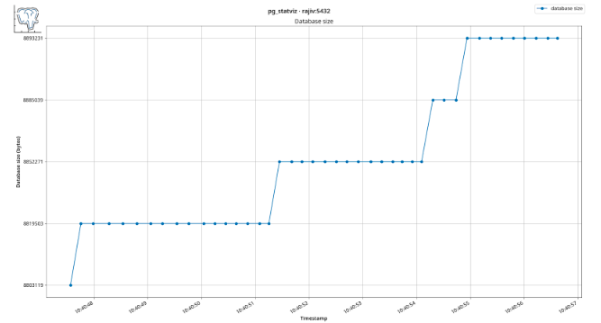

**pg_statviz: Time Series Analysis & Visualization of Statistics**

Postgres GSoC 2023 Proposal

**Mentor :** Jimmy Angelakos \<Author\>

**Applicant :** Rajiv Harlalka

Table of Contents

Contact Information

**Name** : Rajiv Harlalka

**Email**: rajivharlalka009@gmail.com

**IRC**:

**GitHub**: rajivharlalka

**Website**: https://rajivharlalka.tech

**Twitter** : https://twitter.com/rajivharlalka09

**Address**: Azad Hall, Indian Institute of Technology Kharagpur -
721302

West Bengal, India

**Location** : Kolkata, India (GMT +5:30)

**Age** : 21

Personal Information

I'm Rajiv Harlalka, a third-year undergraduate student at the Indian
Institute of Technology, Kharagpur (India). I am a member of , a
university club which organises lectures and events for the students of
IIT Kharagpur about different aspects of Software Engineering and
working in a Community. Open-source projects have made me realise the
importance of documented and easy-to-understand code.

I worked as a student developer in conducted by It is an event in
December where students can work on projects of their interest.

I have a firm C, C++, Python, Golang and Javascript knowledge. I have
been fascinated by the famous Go Proverb "Clear is better than
clever,"which I admire, especially in open source code base. Precise,
reusable functions, so readable that documentation isn't needed often,
impress me greatly. I use Arch Linux as my daily operating system, with
VScode and NeoVim being my most used text editors. I try being a
Terminal Ninja, trying to do things which could be done in seconds using
an alternative GUI tool. Getting those flags correct with man pages
brings me a sense of pleasure and satisfaction.

Project Description

**Title** : pg_statviz: time series analysis & visualization of
statistics

**Size**: Large

**Duration :** 275+ hours

**Time :** 12 weeks

**Technologies :** SQL, PL/pgSQL, Python, Matplotlib, Linux

**Topics :** PostgreSQL Extensions, Packaging in RPM and DEB Systems

Abstract

At present, is the most advanced open-source relational database. One of
the main reasons is its various extensibility, ranging from data types
to functions. PostgreSQL Extensions is one of them, which offers users
build tools as a plugin.

is a PostgreSQL extension with a command line utility pair. The
extension can snapshot cumulative and dynamic statistics of various
PostgreSQL internal tables. These snapshots are stored in another
schema, _pgstatviz,_ which can be queried using SQL for analysis. The
python command-line utility accesses the tables in this schema to
perform time-series analysis and create virtualisations. Using the
packages, database administrators can efficiently perform sophisticated
analysis of their PostgreSQL database statistics over different time
intervals.

Motivation

\*\* \*\*aims to be a minimalist extension that helps administrators tune
their database most efficiently. Having worked with PostgreSQL for quite
some time, pg_statviz seemed a straightforward and quick way to find
loopholes that need tuning for better performance. Having a great
interest in database internals, this project would enable me to learn
more about PostgreSQL internals. Working on this project would give me
great exposure to working with Open Source projects and experienced
people in the community.

Proposed Deliverables (during GSoC)

1.  Add/Update Documentation about the tool.

2.  Fortnightly blogs on developmental advances and milestones.

Project Breakdown

This topic explains the work proposed under each deliverable:

Increased number of modules to the extension.

The Extension currently has a minimal number of statistics available.
PostgreSQL offers a wide range of system catalog tables and internal
views that can generate several metrics to get insights into the
internals. Below is a list of some proposed tables/views that are highly
potential to generate relevant statistics.

- \- count of roles with different privileges like the superuser,
  login, total roles etc.

- \- count of types of table locks imposed on various tables.

- \- number and size of user-defined indexes.

- \- number and size of user-defined tables.

- \- I/O statistics in MB/sec of each user-defined table.

- \- the number of bytes sent/received and lag for each replication.

The code block below is an example of one such module that logs how the
size of the database is increasing, along with the schemas. All the
schema information is stored as a JSON, with the schema size and
schema's total (tables + index) size.

```sql
-- Table that stores details of size of the tables in bytes
CREATE TABLE IF NOT EXISTS @extschema@.schema_size(
    snapshot_tstamp timestamptz REFERENCES @extschema@.snapshots(snapshot_tstamp) ON DELETE CASCADE PRIMARY KEY,
    db_name text,
    db_size bigint,
    schema_analysis jsonb);
-- Function that would captures current size of all schema other than information and pg_catalog and store it in the schema_size table during snapshots.
CREATE OR REPLACE FUNCTION @extschema@.snapshot_schema_size(snapshot_tstamp timestamptz)
RETURNS void
AS $$
    WITH
        dbsize AS (
            SELECT pg_database_size(current_database()) AS db_size),
        schemainfo AS (
            SELECT
                nspname AS schema_name,
                sum(pg_total_relation_size(c.oid)) AS schema_size,
                sum(pg_relation_size(c.oid)) AS schema_size_bytes
            FROM pg_class c
            JOIN pg_namespace n ON n.oid = c.relnamespace
            WHERE nspname NOT IN ('pg_catalog', 'information_schema')
            AND relkind = 'r'
            GROUP BY nspname),
        schemainfojson AS (
            SELECT jsonb_agg(si)
            FROM (
                SELECT schema_name, schema_size, schema_size_bytes
                FROM schemainfo) si)
    INSERT INTO @extschema@.schema_size (
        snapshot_tstamp,
        db_name,
        db_size,
        schema_analysis)
    SELECT
        snapshot_tstamp,
        current_database(),
        (SELECT db_size FROM dbsize),
        (SELECT * FROM schemainfojson);
$$ LANGUAGE SQL;
```

A sample implementation of the corresponding module in the python
package can be something like this. This data can be used to generate
statistics on how the size of the database is growing.

```python
cur = conn.cursor()
cur.execute("""SELECT snapshot_tstamp,db_name,db_size,schema_analysis
                 FROM pgstatviz.schema_size
                 WHERE snapshot_tstamp BETWEEN %s AND %s
                 ORDER BY snapshot_tstamp""",
            (daterange[0], daterange[1]))
data = cur.fetchmany(MAX_RESULTS)
if not data:
    raise SystemExit("No pg_statviz snapshots found in this database")

tstamps = [t['snapshot_tstamp'] for t in data]
db_size = [t['db_size'] for t in data]

# Plot database size
plt, fig = plot.setup()
plt.suptitle(f"pg_statviz · {info['hostname']}:{port}",
             fontweight='semibold')
plt.title("Database size")
plt.plot_date(tstamps, db_size, label="database size", aa=True,
            linestyle='solid')
```

The graph of the following script would look something like this, where
the schema_size data is currently not present but can always be added
used the legend in matplotlib.



The tables\' columns and JSON objects\' structure during each snapshot
are highly subjective. They require prior discussions and documentation,
which I prefer to do during the Community Bonding period.

Addition of Regression Tests

Regression testing is a software testing technique that checks whether
changes to the software have introduced new bugs or caused existing
functionality to break. It is performed after functional or
non-functional changes have been made to the software. Regression
testing aims to ensure that the software continues to function as
expected after changes have been made.

Some basic checks on the extension can be imposed to make sure that the
structure remains correct; even if someday the PostgreSQL internal
tables change, they get caught in the test.

```sql
-- more select statements to test that each of the views is working correctly
SELECT count(*) from pgstatviz.buf JOIN pgstatviz.snapshots USING (snapshot_tstamp);

-- function to check for valid json
create or replace function is_valid_json(p_json text)
  returns boolean
as $$
begin
  return (p_json::json is not null);
exception 
  when others then return false;  
end; $$
language plpgsql immutable;

-- Insert statement test with data_consistency
 SELECT is_valid_json((c.conf::json->>0)) from pgstatviz.conf c; 

-- Validity Check of variables with their expected values  
SELECT conn_total,conn_active FROM pgstatviz.conn;
- Expected Response
 conn_total | conn_active 
------------+-------------
          1 |           1 
```
Writing clean and maintainable tests for each module present in the
command line utility would be achieved for this task. Writing tests
using python packages such as \* _or_ \*and setting up static code
checkers like would help remove bugs.

Creating a GitHub action on the repository as CI that checks for tests,
failing which the pull request cannot be merged, would be part of the
task,as it is currently implemented by using .

A implementation of using Github Action to run tests would look similar
to this. The Action run parallely on multiple Postgres versions in
different containers of which has multiple commands to start testing.

```action
name: CI
on: [push, pull_request]
jobs:
  test:
    strategy:
      matrix:
        pg: [15, 14, 13, 12, 11, 10]
    name: 🐘 PostgreSQL ${{ matrix.pg }}
    runs-on: ubuntu-latest
    container: pgxn/pgxn-tools
    steps:
      - run: pg-start ${{ matrix.pg }}
      - uses: actions/checkout@v3
      - run: pg-build-test
```

Implementation of a Retention policy mechanism to manage old snapshots.

Over time, the statistics can grow a lot, and storage space could be an
issue for some users considering the snapshot details are stored
periodically. In such cases, we need a retention policy mechanism to
manage old snapshots rather than just removing them using . This
mechanism has a variety of areas to play with as to which could seem the
best. Initially, a good enough solution would have a PostgreSQL function
that removes snapshots in an Interval. This topic would require
discussions with the mentor about improvements and whether we should
provide the functionality to upload the data generated to an Object
Store, such as .

Automated backup mechanisms can be set up to preserve statistics data
over the long term, as done by proprietary cloud solutions such as .

Packaging of extensions for PGDG Repositories and Linux Distributions

Extensions in PostgreSQL needs a general build method which works across
distributions without fail. is a simple extension module that provides a
simple build mechanism by automating standard build rules for fairly
basic modules. is also one of the PostgreSQL Extension Distribution
managers, but it does not provide a universal build system, so package
distribution remains an issue. This topic aims to for various
Repositories and Linux Distributions for easy migration and management
of the tool. Packaging for PostgreSQL Extensions needing to be more
documented would require discussions with multiple people who have been
into the packaging of extensions in the past. The primary Linux
distributions focused on packaging purposes are , , and .

The work would start with packaging for Debian-based distro first while
discussing how to proceed with one continues.

Brief Timeline

Pre-GSoC Period

Till 15 April:

I've been reading about the different system tables and views, which can
produce exciting statistics helpful in fine-tuning the hyperparameters.
I'll read the PostgreSQL documentation in detail to examine if some
additional metric could be used. At the same time, I am exploring some
existing extensions and how they are currently maintained, packaged and
distributed. I also plan to share some of my learnings and document some
of the utility tools and metrics I found useful for processing the
tables.

Community Bonding Period \[ 3 Weeks\]

During the community bonding period, I would start discussing any change
in the proposal with my mentor and exploring the documentation for more
insights. I would also begin communication with people in the context of
packaging repositories for Red Hat distributions, as it can have issues
unknown at this point, and the lack of documentation makes it more
uncertain.

By the end of the Community Bonding Period, I aim to:

- Get more familiar with PostgreSQL documentation.

- Having a fair idea of proceeding with packaging extensions for Linux
  distributions.

- Ready with all the development-related setup that I would need in
  the future.

Coding Period 1 \[29 May - 10 July\]

Week 1 - Week 3 \[ 29 May - 19 June \]

With the updated list of modules to be added, I will begin working on
the extension and python utility simultaneously. By the end of week 3, I
aim to publish a newer version of the extension and the python utility
on pip. I would simultaneously add documentation related to the newly
added modules, along with the internal tables of the _pgstatviz_ schema.

An expected flow of module creation can be listed in the following
order:

1.  Get to know the possible views, and tables can be used to fetch all
    possible information.

2.  List columns whose data would provide good statistics for
    evaluation.

3.  Create the module in the extension along with basic tests to define
    the structure of the respective module tables. .

4.  Add unit tests for the new module in the python utility.

5.  Create a script that generates a visualization of the module in the
    most appropriate plot (example: barplot, line plot, flamegraphs)

6.  Add regression test to the python utility.

When the packaging mechanism is updated later, these additions will be
automatically added to the newer version and up for usage.

Week 4 - Week 6 \[ 19 June - 10 July \]

I would start adding regression test suites to each python utility
module. Writing test_suites by following and would be aimed so that
future contributors can also test the addition of modules effortlessly.
By the end of week 6, a thoroughly tested utility would be ready, hence
a minor version bump of the utility. I would also look back over
discussions on packaging to mitigate any areas of unknown complexity.

Phase - 1 Evaluations

Expected Outcomes at this stage:

- A fresh set of modules added to the Extension.

- A complete testing suite ready for the command line utility.

Coding Period 2 \[ 12 July - 21 August\]

Week 7 \[12 July - 19 July\]

This week will focus mainly on building a retention policy mechanism for
old snapshots from the table. I would start with a basic implementation
of creating a function that deletes snapshots from an interval. Next,
move with iterating towards a better solution which was finalized during
the community bonding period.

Week 8 - Week 10 \[ 19 July - 10 August \]

By this time, I will have a clear idea of the packaging of Postgres
Extensions for different Linux distributions is done. I would get
familiarised with new tools(if any) and would have created some sample
testing packages to ease up while taking up this part.

PGDG supports packaging for several Red-Hat distributions, such as
Fedora, Rocky Linux, etc. and an for Debian and Ubuntu systems. Packages
for these distributions are available through their respective package
managers with the PostgreSQL repository add-on.

I would start with creating packages for Red Hat repository and then
move on to the Debian repository. Considering the packages might be of
two types, one with the python utility and one without, this would also
need documentation for users to know which package suits them best and
how to install it on their system.

Week 11- Week 12 \[10 August - 21 August\]

I would utilise this time to complete any leftover unit tests,
documentation updates, bug fixes, and other fixations. I would also use
this time as a buffer period in case of any lag in the schedule.

In case of no delays, I would use this time for some post-GSoC work
mentioned below.

Phase - 2 Evaluations

Post GSoC Plans:

I'm **not** applying for GSoC under any other organisation this year
since I am motivated by PostgreSQL\'s journey and want to be an integral
part of it. I would even love to become a long-term maintainer of the
project, thereby helping newcomers to guide incase of issues.

I would improve any missing parts in the documentation of PostgreSQL.
Lack of documentation causes extensions to be a less explored part of
PostgreSQL. External blog posts on the Internet explain how extensions
work, but a complete and correct flow remains a treasure. Exploring the
exact need for files and design practices is hard to find in the
plethora of documents, and an aggregate of all such docs would be a
great addition. Adding documentation about how to package extensions
would also be taken up slowly, as it would help future packagers find a
consolidated place for all information.

I plan on taking up some other projects post-GSoC for contributions
later on. ""was one of the other projects that fascinated me on the
ideas page. Curious, I check the EXPLAIN results every time to get great
insights into how my query is planned. Working on its improvement would
help the community and me a lot.

Along with that, I'll always be a part of PostgreSQL and will be
following (as well as contributing towards) its development. I will
always be available to make changes to the project and expand its
feature set when necessary.

Additional Information about the Timeline

- The timeline mentioned above is subject to change and is only an
  approximate outline of my project work. I will stick to or exceed
  this schedule and create a more detailed schedule during the
  pre-GSoC and community bonding phase.

- I've no other commitments during the summer and can dedicate 30 to
  35 hours a week. During the last month of the project, my college
  will begin, and I'll be able to commit a max of 20 a week. Due to
  the same, I will do a significant portion of the work before this
  period.

- Fortnightly blogs will be maintained at and will include highlights
  of the development process and methods used to overcome hurdles.

- Time will be divided (according to workload) each week amongst
  planning, learning, coding, documenting and testing features. All
  documentation will go hand in hand with the development.

Contributions

- \[OPEN\][hostname command not found](https://github.com/vyruss/pg_statviz/pull/1)

- \[CLOSED\][Add CI for running tests](https://github.com/vyruss/pg_statviz/pull/2)

References

Links have been added at appropriate locations throughout the text,
directing to multiple relevant references. Below are some other
resources relevant to the context of the proposal.
- [System Catalog Tables/ Views](https://www.postgresql.org/docs/current/catalogs.html)
- [Monitoring Statistics Tables/Views](https://www.postgresql.org/docs/current/monitoring-stats.html)
- [The pg_stat_io extension by pganalyze](https://pganalyze.com/blog/pg-stat-io)
- [Extending PGXS Build mechanism](https://www.postgresql.org/docs/current/extend-pgxs.html)
- [Building Fedora Packages](https://docs.fedoraproject.org/en-US/package-maintainers/Packaging_Tutorial_GNU_Hello/)

