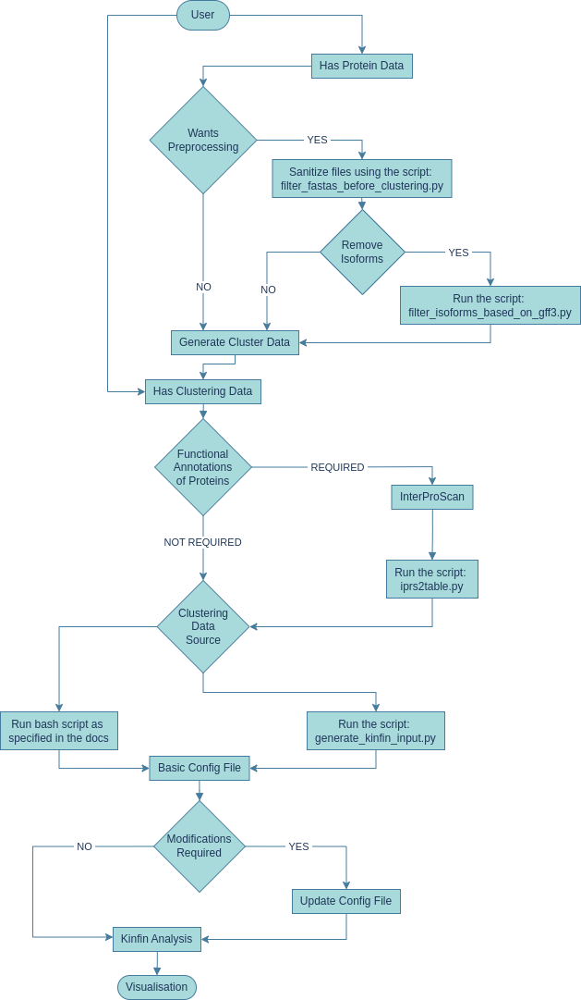

# Project Proposal

## Integrating KinFin Proteome Cluster analyses into Genome Browsing environments

-   **Organisation** : Wellcome Sanger Tree of Life
-   **Mentor** : Dr. Richard Challis
-   **Applicant** : Rohan Rajendra Barsagade

# PERSONAL INFORMATION

## CONTACT INFORMATION

-   **NAME** : Rohan Rajendra Barsagade
-   **EMAIL** : rbarsagade101@gmail.com
-   **GITHUB** : [rohan-b-84](https://www.github.com/rohan-b-84)
-   **LINKEDIN** : [r-barsagade](https://www.linkedin.com/in/r-barsagade)
-   **WEBSITE** : [https://rbarsagade.tech](https://rbarsagade.tech)
-   **LOCATION** : Kharagpur, West Bengal, India
-   **TIMEZONE** : IST (UTC +5:30)

## STUDENT AFFILIATION

-   **UNIVERSITY** : Indian Institute of Technology Kharagpur
-   **DEGREE** : Bachelors of Technology (B.Tech.)
-   **MAJOR** : Biotechnology & Biochemical Engineering (with micro-specialization in Artificial Intelligence and its Applications)
-   **EXPECTED GRADUATION** : 2025

## BRIEF BIO

I am Rohan R. Barsagade, a third-year undergraduate student at the Indian Institute of Technology Kharagpur (India). I am interested in exploring innovative ways to analyse and interpret biological data, particularly in the field of systems biology and bioinformatics, and leverage the potential of computational tools to speed up biological research.

My programming language skill set spans Python, C, C++, Golang, and Javascript.

Through my involvement in open-source projects, I have come to appreciate the importance of well-documented, readable, and maintainable code, especially at the intersection of biotechnology and open-source software development, where freely available code empowers researchers around the world. It is this focus on clean, clear, and reusable code that has drawn me to the KinFin project.

# PROJECT DESCRIPTION

## ABSTRACT

KinFin is a computational tool designed for the analysis and visualisation of protein family clusters. However, KinFin currently lacks integration with web-based genome browsing systems such as Ensembl and GenomeHubs. This project proposes an initiative aimed at facilitating access to KinFin's functionalities within the context of these genome browsing platforms via a two-phased approach to address this gap.

## BACKGROUND

Understanding protein families, groups of proteins that share ancestral lineage and functional characteristics, is vital for biology. Bioinformatics tools like OrthoFinder automate identification of these groups, but visualising the massive data they generate remains a challenge. KinFin is a tool designed to analyse protein families, offering valuable insights, but integrating it with genome browsers is challenging, primarily due to the complexity of KinFin's data files and their incompatibility with genome browser formats.

Kinfin's current workflow is fragmented. Researchers need to use several separate scripts for tasks like preprocessing, leading to a slow and disjointed experience.

Additionally, KinFin results are presented in different file formats, making it difficult for researchers to explore their data effectively due to incompatibility with genome browsing environments. This incompatibility with genome browsers restricts researchers from utilising all the information at their disposal.

Establishing a direct pipeline and API integration between KinFin and genome browsers could resolve the existing challenges. This integration would improve the workflow, enhance data accessibility, and enable intuitive visualisation of protein families within their genomic context. By combining the capabilities of KinFin and genome browsers, researchers would greatly benefit from leveraging the strengths of both platforms, facilitating their research work.

## PROJECT PROPOSAL

### OVERVIEW

This proposal outlines a **two-phased approach** to integrate KinFin Proteome Cluster analyses into Genome Browsing environments:

-   **Phase 1**: Phase 1 will focus on refactoring the KinFin code-base to improve its code maintainability, readability, and testability and make the way for a web-based integration.

-   **Phase 2**: Phase 2 will establish the KinFin as a Service (KaaS) API which can integration with genome browsing platforms like GenomeHubs

#### Technologies

The primary technology used will be **Python** and **Git**. 
Within Python, I am thinking of using FastAPI as the specific framework for the API implementation (Phase 2). This is because FastAPI provides high-performance request handling and also handles automatic API documentation generation.

### PLAN OF ACTION

#### Phase 1: Refactoring the KinFin code-base

Currently, KinFin's code-base is primarily in a single large Python file `kinfin.py` within the `/src` directory. This file contains **various classes, data manipulation methods, and utility functions exceeding 2000 lines**. Additionally, the project structure **includes build and distribution files** alongside example input files, scripts, and dependency management files. The code-base also has **some Python 2 syntax**, which is no longer recommended.

Phase 1 will focus on refactoring the code for maintainability, readability, and testability.

_**Image**: Screenshot from `kinfin.py` file showing multiple utility functions and classes defined_

 

_**Image**: Screenshot `from filter_isoforms_based_on_gff3.py` file showing outdated Python2 syntax_

##### Phase 1 Goals:

-   Refactor KinFin into smaller, well-defined modules for improved code maintainability and comprehension
-   Enable compatibility with external applications like genome browsing environments by making KinFin's output consumable by them (e.g., JSON, CSV formats)
-   Ensure core KinFin functionality remains intact throughout the refactoring process

##### Phase 1 Tasks:

1. Update the code-base and migrate to Python 3 syntax for wider compatibility.
2. Breakdown monolithic `kinfin.py` file into smaller, independent, and reusable modules which modules can then be imported and utilised as needed.
3. Decouple application logic from data manipulation routines to enable integration within both a Command-Line Interface (CLI) and API environments.
4. Refactor KinFin's output generation to support both CLI and API needs.
5. Remove unnecessary build and distribution files from the version control system and introduce a `.gitignore` file to manage the exclusion of specific files from version control.

##### Phase 1 Deliverables:

-   A well-structured KinFin code-base with modularized components
-   Code-base migrated to Python 3 for improved compatibility and adherence to modern practices
-   Refactored logic for stateless operation, enabling API integration
-   Flexible output generation capabilities, supporting both CLI application and API (JSON) formats
-   Improved project management with the implementation of a `.gitignore` file
-   Documentation on the revised project structure

##### Phase 1 Benefits

-   Enhanced code maintainability, readability, and testability due to modularization.
-   Broader compatibility with external applications due to Python 3 migration
-   Stateless architecture and flexible output format for easy scalability and flexibility
-   Improved project organisation and management through version control best practices

#### Phase 2: Implementing KaaS API Architecture

The second phase of this project focuses on establishing a KinFin-as-a-Service (KaaS) API, paving the way for integration with Genome Browsing environments like GenomeHubs.

Currently, KinFin analysis relies on a series of independent scripts for data preprocessing, configuration, and core analysis functionalities. Users navigate through a sequence of scripts, making decisions about data preprocessing (filtering, isoform removal, etc.) and functional annotation retrieval (InterProScan) at each step based on their requirements. This approach necessitates managing output and config files at the end of each step and navigating complex user flows.

Designing the KaaS API will involve analysing the user flow and identifying critical decision points within the user flow (as shown in the flowchart). These points would represent functionalities currently controlled by the requirements of the user and the configuration file and would be the key to determine the script execution sequences.

The KaaS API will be designed to capture these decision points as API parameters. This will allow users and applications to specify desired functionalities (e.g., data preprocessing, annotation retrieval) without relying on complex configuration files. Users would submit data and configuration parameters directly through the API, receiving analysis results in a standardised format like JSON. This would simplify the workflow and facilitate integration with external systems.

To ensure a robust and maintainable API, we will initially prioritise essential features like data submission, core KinFin analysis, and result delivery in JSON format. Subsequently, it can then be upgraded to systematically integrate additional user configuration options based on mentor’s feedback and project priorities.

While the API is the primary focus of Phase 2, the KinFin script itself will not be abandoned. We will introduce a `--serve` flag to the script. This flag, when used, will deploy the KinFin service, making it accessible through API calls. However, the script's existing functionality with its traditional arguments will be preserved. This would ensure continuity for existing users who prefer a command-line workflow and provides a familiar interface alongside the new API access.

_**Figure**: User Flow devised based on KinFin documentation_

##### Phase 2 Goals:

-   Develop a well-defined API architecture to expose KinFin's functionalities as a web service
-   Implement a Minimum Viable Product (MVP) of the KaaS API with essential functionalities for basic KinFin analysis
-   Progressively enhance the KaaS API to encompass the full range of KinFin's configuration options
-   Maintain the existing CLI functionality for users who might prefer a command-line workflow.

##### Phase 2 Tasks:

1. Define the API structure, including endpoints, data models, request parameters, and response formats
2. Develop the initial API endpoint to handle basic cluster data analysis. Users can submit essential data like clustering data and sequence IDs through the API and receive KinFin's core analysis results in JSON format.
3. Progressively expand the API functionalities by creating additional endpoints that mirror the complete KinFin user flow (represented by the flowchart). Each endpoint will address specific user decisions and data manipulations, like data pre-processing, isoform removal, functional annotations, and configuration options.
4. Integrate the API functionalities within the existing KinFin script. A `--serve` flag will allow users to deploy the KinFin service, making it accessible through API calls. Traditional CLI functionality using existing arguments will still be available.
5. Develop comprehensive API documentation to guide users on endpoint usage, data formats, and expected responses. Implement robust error handling mechanisms to provide informative messages in case of issues.

##### Phase 2 Deliverables:

-   A well-documented API specification outlining API endpoints, request/response structures, and data formats.
-   Functional API endpoints that provide KinFin’s protein cluster data analysis
-   Progressively implemented API endpoints mirroring the complete KinFin user flow.
-   A KinFin script with integrated API capabilities, allowing users to choose between CLI and API access using the `--serve` flag
-   Comprehensive API documentation and error handling mechanisms.

##### Phase 2 Benefits:

-   Increased accessibility to KinFin functionalities through a user-friendly API.
-   Preserved CLI functionality to ensure continuity for existing users.
-   Integration with Genome Browsing environments like GenomeHubs.
-   Improved user experience with clear documentation and informative error handling.

### TIMELINE

#### Timeline / Milestones

-   **Week 1**: In the first week, I will focus on migrating from Python 2 to Python 3 and updating the repository to include build and dist files in gitignore. Additionally, I will update the readme to include instructions on how to build the service.
-   **Week 2 and 3**: After migrating to Python 3, I will work on modularizing the KinFin code-base. This involves restructuring the repository to organise utility functions and class definitions into separate files, making them easier to manage and use.
-   **Week 4 and 5**: Once the initial organisation is complete, I will begin establishing the architecture for the KaaS service. This will involve transitioning from a stateful to a stateless implementation wherever possible.
-   **Week 6**: I will focus on documenting all the changes made during the modularization and architecture setup. I will also update the plans for the different KaaS endpoints if necessary.
-   **Week 7 and 8**: In Week 7, I will begin implementing the KaaS service by installing necessary dependencies for a basic FastAPI architecture and planning the API design. By Week 8, I aim to have a basic API endpoint implemented, returning analysis data in JSON format that can be utilised by genome browsers for visualisation.
-   **Week 9 to 11**: During the Weeks 9, 10, and 11, I will focus on expanding the basic endpoints to include various customizable analysis options provided by KinFin. This will be done progressively, starting with basic endpoints and gradually incorporating more advanced configuration options.
-   **Week 12**: Week 12 will involve project wrap-up, including testing, error handling, and completion of any remaining tasks.

#### Commitments

During weekdays (Monday through Friday), I will be able to dedicate **3-5 hours** to project work, ensuring alignment with UK working hours. This allows for efficient communication and collaboration. To compensate for the reduced weekday schedule, I'm happy to invest additional hours on weekends (Saturday and Sunday) – typically **7-8 hours** per day. This extended weekend commitment ensures I meet the proposed timeline while respecting the time zone difference.

#### Additional Information about the Timeline

-   The timeline mentioned above is subject to change and is only an approximate outline of my project work. I will stick to or exceed this schedule and create a more detailed schedule during the pre-GSoC and community bonding phase.
-   I've no other commitments during the summer and can dedicate 30 to 35 hours a week. During the last month of the project, my college will begin, and I'll be able to commit a max of 20 a week. Due to the same, I will do a significant portion of the work before this period.
-   Time will be divided (according to workload) each week amongst planning, learning, coding, documenting and testing features. All documentation will go hand in hand with the development.

### POST GSOC PLANS

I am committed to the long-term sustainability and success of the KinFin project. While the initial scope of this proposal focuses on users providing the clustering data from OrthoFinder and uploading necessary files, I recognize the potential for further enhancing user experience. Time permitting, I would like to explore the possibility of allowing users to submit only accession numbers of the protein sequences they wish to analyse. This would streamline the user workflow by eliminating the need to manage and upload individual files. Additionally, the possibility of developing a dedicated user interface for the KinFin service can be explored to further enhance user experience.
